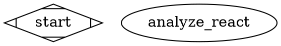

# Kilo Gateway Integration Guide

This guide shows you how to use Attractor with Kilo Gateway to run AI-powered workflows using hundreds of models from multiple providers.

## 🚀 Quick Start

### 1. Get Your Kilo API Key
1. Visit [app.kilo.ai](https://app.kilo.ai)
2. Sign up or log in to your account  
3. Navigate to API settings
4. Generate a new API key

### 2. Set Up Environment
```bash
export KILO_API_KEY="your-api-key-here"
export KILO_CONFIG="balanced"  # Optional: budget|balanced|performance
export KILO_COST_BUDGET="10.00"  # Optional: daily budget in USD
```

### 3. Run Your First Workflow
```bash
# Analyze your codebase with AI
node run-with-kilo.js workflows/comprehensive-code-analysis.dot ./your-project

# Generate documentation
node run-with-kilo.js workflows/documentation-suite.dot ./your-project

# Create comprehensive test suite
node run-with-kilo.js workflows/testing-pipeline.dot ./your-project
```

## 🎯 Key Features

### Smart Model Routing
Automatically selects the best AI model for each task:

| Task Type | Recommended Model | Why |
|-----------|-------------------|-----|
| Code Analysis | Claude Sonnet 4.5 | Excellent code understanding |
| Security Review | Claude Opus 4.6 | Thorough security analysis |
| Documentation | GPT-4o | Clear, engaging writing |
| Quick Tasks | GPT-4o Mini | Cost-effective for simple tasks |

### Configuration Presets

#### Budget Configuration (`KILO_CONFIG=budget`)
- Optimized for cost-effectiveness  
- Daily budget: ~$1
- Uses cheaper models where possible
- Still maintains quality for critical tasks

#### Balanced Configuration (`KILO_CONFIG=balanced`) - **Recommended**
- Best performance/cost ratio
- Daily budget: ~$10
- Smart model selection based on task complexity
- Premium models for security and complex analysis

#### Performance Configuration (`KILO_CONFIG=performance`)
- Maximum quality regardless of cost
- Uses premium models for all tasks
- Best for critical production workflows

### Cost Tracking & Monitoring
- Real-time cost estimation
- Usage analytics by model and workflow
- Budget alerts and controls
- Efficiency recommendations

## 📋 Available Workflows

### 1. Comprehensive Code Analysis
**File:** `workflows/comprehensive-code-analysis.dot`

**What it does:**
- Project structure analysis
- Security vulnerability assessment  
- Performance optimization review
- Code quality evaluation
- Test coverage analysis
- Detailed reporting with action items

**Best for:** Regular code health checks, pre-deployment reviews

### 2. Documentation Suite  
**File:** `workflows/documentation-suite.dot`

**What it does:**
- README generation
- API documentation
- User guides and tutorials
- Development setup instructions
- Architecture documentation

**Best for:** Open source projects, API documentation, onboarding

### 3. Testing Pipeline
**File:** `workflows/testing-pipeline.dot`

**What it does:**
- Test scenario identification
- Unit/integration/E2E test generation
- Coverage analysis and recommendations
- Performance test creation
- CI/CD integration guidance

**Best for:** Improving test coverage, automated testing setup

### 4. Development Lifecycle
**File:** `workflows/development-lifecycle.dot`

**What it does:**
- Feature planning and design
- Implementation guidance
- Code review preparation  
- Security and performance validation
- Deployment preparation

**Best for:** End-to-end feature development, team workflows

## 🛠️ Advanced Usage

### Custom Model Selection
```bash
# Override model for specific workflow
KILO_MODEL="anthropic/claude-opus-4-6" node run-with-kilo.js workflows/security-audit.dot

# Use budget models only
KILO_CONFIG=budget node run-with-kilo.js workflows/quick-review.dot
```

### Cost Management
```bash
# Set daily budget limit
KILO_COST_BUDGET=5.00 node run-with-kilo.js workflows/comprehensive-code-analysis.dot

# Enable verbose cost tracking  
VERBOSE=true node run-with-kilo.js workflows/documentation-suite.dot
```

### Organization Settings
```bash
# Use organization-level settings
export KILO_ORG_ID="your-org-id"
export KILO_TASK_ID="project-analysis-2024"
```

## 📊 Monitoring & Analytics

### View Usage Statistics
Usage data is automatically tracked in `./logs/usage-tracking.json`:

- **Cost breakdown by model**
- **Performance metrics**  
- **Success rates**
- **Efficiency recommendations**

### Generate Usage Reports
```bash
# The runner automatically generates reports in logs/
ls logs/*/workflow-summary.json
```

## 🔧 Integration with Your Projects

### 1. Project-Specific Workflows
Create custom `.dot` files tailored to your project:



### 2. CI/CD Integration
```yaml
# .github/workflows/ai-review.yml
name: AI Code Review
on: [pull_request]

jobs:
  ai-review:
    runs-on: ubuntu-latest
    steps:
      - uses: actions/checkout@v3
      - name: Run AI Code Analysis
        env:
          KILO_API_KEY: ${{ secrets.KILO_API_KEY }}
          KILO_COST_BUDGET: "2.00"
        run: |
          node run-with-kilo.js workflows/comprehensive-code-analysis.dot ./
```

### 3. Team Workflows
```bash
# Different team members can use different configs
# Junior developer - budget mode
KILO_CONFIG=budget node run-with-kilo.js workflows/code-analysis.dot

# Senior developer - performance mode  
KILO_CONFIG=performance node run-with-kilo.js workflows/security-review.dot
```

## 🚨 Troubleshooting

### Common Issues

**"Provider 'kilo' is not registered"**
- Ensure `KILO_API_KEY` is set correctly
- Check API key is valid at [app.kilo.ai](https://app.kilo.ai)

**"Payment required: Insufficient Kilo balance"**  
- Add credits to your Kilo account
- Check current usage at [app.kilo.ai](https://app.kilo.ai)

**"Rate limited: Too many requests"**
- Workflows include automatic retry logic
- Consider using `budget` configuration to reduce request frequency

**Workflow fails at human review steps**
- Human review nodes require interactive input
- Press `[A]` to approve, `[R]` to request changes

### Debug Mode
```bash
VERBOSE=true node run-with-kilo.js workflows/comprehensive-code-analysis.dot ./
```

## 📈 Best Practices

### 1. Cost Optimization
- Start with `balanced` configuration
- Use `budget` mode for development/testing
- Reserve `performance` mode for production workflows
- Set daily budget limits to control costs

### 2. Workflow Selection  
- Use `comprehensive-code-analysis` for thorough reviews
- Use `documentation-suite` for open source projects
- Use `testing-pipeline` when improving test coverage
- Use `development-lifecycle` for new feature development

### 3. Model Selection
- Trust the smart routing for most use cases
- Override only when you need specific model capabilities
- Monitor usage reports to optimize model choices

### 4. Security
- Never commit API keys to version control
- Use environment variables for configuration
- Review usage reports regularly for unexpected activity

## 🤝 Support

### Demo & Testing
```bash
# Run demo to test integration
node kilo-demo.js

# Test without API key (simulation mode)
node run-with-kilo.js workflows/comprehensive-code-analysis.dot ./
```

### Documentation
- [Kilo Gateway Docs](https://kilo.ai/docs/gateway)
- [Attractor README](./README.md)  
- [Workflow Examples](./examples/)

### Community  
- [Kilo GitHub](https://github.com/Kilo-Org/kilocode)
- [Attractor Issues](https://github.com/strongdm/attractor/issues)

## 🎉 What's Next?

1. **Try the workflows** on your own projects
2. **Create custom workflows** for your specific needs  
3. **Integrate with CI/CD** for automated code analysis
4. **Share feedback** on model performance and cost optimization
5. **Contribute workflows** back to the community

---

*Happy coding with AI-powered workflows! 🤖✨*