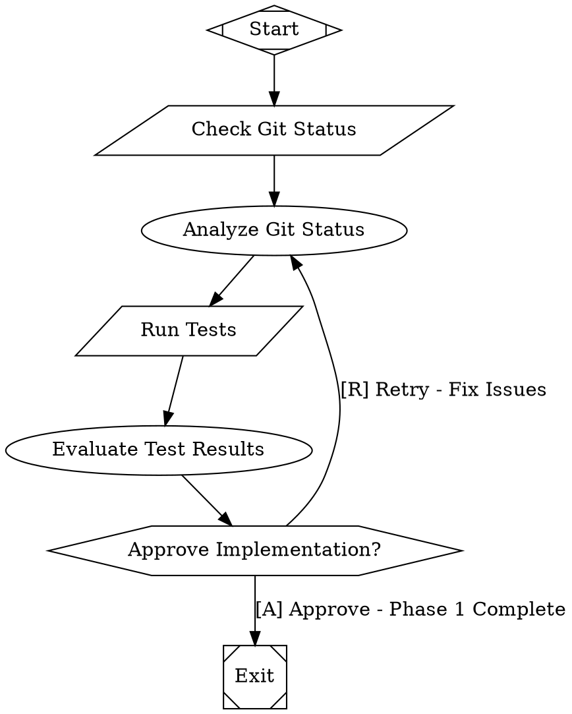

# Phase 1 Implementation Plan: Critical Foundation for Self-Hosting

## 📋 **Overview**
Implement the 4 critical foundation components that enable basic self-hosting capabilities within 2-3 days.

**Goal:** Enable Attractor to use AI workflows to analyze its own code, run tests, and execute basic development tasks.

**Success Criteria:** Attractor can execute a self-hosting workflow that analyzes code, runs tests, and creates commits.

---

## 🎯 **Task Checklist**

### **Task 1: ValidationEngine Export Fix** ⚡ *5 minutes*
- [ ] **1.1** Add ValidationEngine export alias to `src/index.js`
- [ ] **1.2** Keep existing PipelineLinter export for backward compatibility
- [ ] **1.3** Create test script to verify both exports work
- [ ] **1.4** Test import in Node REPL

**Files Modified:**
- `src/index.js` - Add export line

**Implementation:**
```javascript
export { PipelineLinter as ValidationEngine } from './validation/linter.js';
```

**Testing:**
```javascript
// Test: Both ValidationEngine and PipelineLinter should be importable
import { ValidationEngine, PipelineLinter } from './src/index.js';
console.log('ValidationEngine:', typeof ValidationEngine);
console.log('Same class:', ValidationEngine === PipelineLinter);
```

---

### **Task 2: Resume Method Implementation** 🔄 *1 hour*
- [ ] **2.1** Add `loadCheckpoint(checkpointPath)` method to PipelineEngine
- [ ] **2.2** Add `_restoreContext(values, logs)` helper method to PipelineEngine  
- [ ] **2.3** Add `resume(checkpointPath)` method to Attractor class
- [ ] **2.4** Implement `engine.resume(checkpointPath)` method
- [ ] **2.5** Create unit tests for checkpoint loading
- [ ] **2.6** Create integration test for resume functionality
- [ ] **2.7** Test resume with real workflow

**Files Modified:**
- `src/pipeline/engine.js` - Add checkpoint loading methods
- `src/index.js` - Add resume method to Attractor class

**Implementation Details:**
```javascript
// In PipelineEngine
async loadCheckpoint(checkpointPath) {
  const checkpoint = JSON.parse(await fs.readFile(checkpointPath));
  return {
    context: this._restoreContext(checkpoint.context_values, checkpoint.logs),
    currentNode: checkpoint.current_node,
    completedNodes: checkpoint.completed_nodes
  };
}

_restoreContext(values, logs) {
  const context = new Context();
  if (values) {
    for (const [key, value] of Object.entries(values)) {
      context.set(key, value);
    }
  }
  if (logs) {
    context.logs = [...logs];
  }
  return context;
}

async resume(checkpointPath) {
  const { context, currentNode, completedNodes } = await this.loadCheckpoint(checkpointPath);
  return await this._resumeFromState(context, currentNode, completedNodes);
}

// In Attractor class
async resume(checkpointPath) {
  return await this.engine.resume(checkpointPath);
}
```

---

### **Task 3: Variable Expansion Enhancement** 🔧 *1-2 days*
- [ ] **3.1** Create `src/pipeline/variable-expander.js` utility class
- [ ] **3.2** Implement VariableExpander class with expand() method
- [ ] **3.3** Support built-in variables: `$goal`, `$last_response`, `$current_node`, `$outcome`
- [ ] **3.4** Support context variables: `$key_name` pattern matching
- [ ] **3.5** Support nested context keys with dot notation conversion
- [ ] **3.6** Update CodergenHandler to use new expander
- [ ] **3.7** Add variable expansion to other handlers as needed
- [ ] **3.8** Create comprehensive variable expansion tests
- [ ] **3.9** Test with complex nested scenarios
- [ ] **3.10** Regression test existing `$goal` functionality

**Files Created:**
- `src/pipeline/variable-expander.js` - New utility class

**Files Modified:**
- `src/handlers/codergen.js` - Replace _expandVariables method
- Other handlers that process prompts (as needed)

**Implementation Details:**
```javascript
export class VariableExpander {
  expand(text, graph, context, currentNodeId) {
    let expanded = text;
    expanded = this._expandBuiltinVariables(expanded, graph, context, currentNodeId);
    expanded = this._expandContextVariables(expanded, context);
    return expanded;
  }
  
  _expandBuiltinVariables(text, graph, context, currentNodeId) {
    return text
      .replace(/\$goal/g, graph.goal || '')
      .replace(/\$current_node/g, currentNodeId || '')
      .replace(/\$last_response/g, this._truncate(context.get('last_response', ''), 200))
      .replace(/\$outcome/g, context.get('outcome', ''));
  }
  
  _expandContextVariables(text, context) {
    // Pattern: $key_name -> context.get('key_name')
    // Pattern: $user_settings -> context.get('user.settings')
    return text.replace(/\$([a-zA-Z_][a-zA-Z0-9_]*)/g, (match, varName) => {
      const contextKey = varName.replace(/_/g, '.');
      return context.get(contextKey, match);
    });
  }
  
  _truncate(text, maxLength) {
    if (!text || text.length <= maxLength) return text || '';
    return text.slice(0, maxLength - 3) + '...';
  }
}
```

---

### **Task 4: Tool Handler Implementation** 🛠️ *2-3 days*
- [ ] **4.1** Create `src/handlers/tool.js` with ToolHandler class
- [ ] **4.2** Implement command execution with child_process
- [ ] **4.3** Add timeout support from node.timeout attribute
- [ ] **4.4** Add variable expansion in commands
- [ ] **4.5** Implement result handling (stdout, stderr, exit code)
- [ ] **4.6** Add context updates with tool results
- [ ] **4.7** Implement comprehensive error handling
- [ ] **4.8** Add logging (command, output to logs directory)
- [ ] **4.9** Register ToolHandler in default setup
- [ ] **4.10** Export ToolHandler from main module
- [ ] **4.11** Create unit tests for command execution
- [ ] **4.12** Test timeout and error scenarios
- [ ] **4.13** Test variable expansion in commands  
- [ ] **4.14** Integration test with real workflow

**Files Created:**
- `src/handlers/tool.js` - New ToolHandler class

**Files Modified:**
- `src/index.js` - Register and export ToolHandler

**Implementation Details:**
```javascript
import { spawn } from 'child_process';
import { Handler } from './registry.js';
import { Outcome, StageStatus } from '../pipeline/outcome.js';
import { VariableExpander } from '../pipeline/variable-expander.js';
import fs from 'fs/promises';
import path from 'path';

export class ToolHandler extends Handler {
  async execute(node, context, graph, logsRoot) {
    // 1. Get command from prompt or label
    let command = node.prompt || node.label;
    if (!command) {
      return new Outcome(StageStatus.FAIL, 'No command specified for tool node');
    }
    
    // 2. Expand variables in command
    const expander = new VariableExpander();
    command = expander.expand(command, graph, context, node.id);
    
    // 3. Parse timeout
    const timeoutMs = this._parseTimeout(node.timeout);
    
    // 4. Create logs directory
    const nodeLogsDir = path.join(logsRoot, node.id);
    await fs.mkdir(nodeLogsDir, { recursive: true });
    
    // 5. Log command
    await fs.writeFile(path.join(nodeLogsDir, 'command.txt'), command);
    
    // 6. Execute command
    const result = await this._executeCommand(command, timeoutMs);
    
    // 7. Log results
    await fs.writeFile(path.join(nodeLogsDir, 'stdout.txt'), result.stdout);
    await fs.writeFile(path.join(nodeLogsDir, 'stderr.txt'), result.stderr);
    await fs.writeFile(path.join(nodeLogsDir, 'exit_code.txt'), result.exitCode.toString());
    
    // 8. Update context and return outcome
    return this._handleResult(result, context);
  }
  
  async _executeCommand(command, timeoutMs) {
    return new Promise((resolve, reject) => {
      const child = spawn('sh', ['-c', command], {
        stdio: 'pipe'
      });
      
      let stdout = '';
      let stderr = '';
      let timeoutId = null;
      
      child.stdout.on('data', (data) => {
        stdout += data.toString();
      });
      
      child.stderr.on('data', (data) => {
        stderr += data.toString();
      });
      
      child.on('close', (code) => {
        if (timeoutId) clearTimeout(timeoutId);
        resolve({
          exitCode: code,
          stdout: stdout,
          stderr: stderr
        });
      });
      
      child.on('error', (error) => {
        if (timeoutId) clearTimeout(timeoutId);
        reject(error);
      });
      
      // Set timeout
      if (timeoutMs > 0) {
        timeoutId = setTimeout(() => {
          child.kill('SIGKILL');
          reject(new Error(`Command timed out after ${timeoutMs}ms`));
        }, timeoutMs);
      }
    });
  }
  
  _parseTimeout(timeout) {
    if (!timeout) return 30000; // Default 30 seconds
    
    if (typeof timeout === 'number') return timeout;
    
    if (typeof timeout === 'string') {
      const match = timeout.match(/^(\d+(?:\.\d+)?)\s*(ms|s|m|h)?$/);
      if (!match) return 30000;
      
      const value = parseFloat(match[1]);
      const unit = match[2] || 's';
      
      switch (unit) {
        case 'ms': return value;
        case 's': return value * 1000;
        case 'm': return value * 60 * 1000;
        case 'h': return value * 60 * 60 * 1000;
        default: return value * 1000;
      }
    }
    
    return 30000;
  }
  
  _handleResult(result, context) {
    // Update context with tool results
    context.set('tool.stdout', this._truncate(result.stdout, 500));
    context.set('tool.stderr', this._truncate(result.stderr, 500));
    context.set('tool.exit_code', result.exitCode);
    
    // Determine success/failure
    if (result.exitCode === 0) {
      return new Outcome(
        StageStatus.SUCCESS,
        `Command executed successfully (exit code: ${result.exitCode})`
      );
    } else {
      return new Outcome(
        StageStatus.FAIL,
        `Command failed with exit code: ${result.exitCode}`
      );
    }
  }
  
  _truncate(text, maxLength) {
    if (!text || text.length <= maxLength) return text || '';
    return text.slice(0, maxLength - 3) + '...';
  }
}
```

---

## 🧪 **Testing Plan**

### **Unit Tests**
- [ ] **Create** `test/phase1-unit.test.js`
- [ ] Test ValidationEngine export
- [ ] Test resume functionality components
- [ ] Test variable expansion edge cases
- [ ] Test tool handler command execution

### **Integration Tests** 
- [ ] **Create** `test/phase1-integration.test.js`
- [ ] End-to-end workflow with all Phase 1 features
- [ ] Resume workflow from checkpoint
- [ ] Tool handler in real pipeline
- [ ] Variable expansion across multiple nodes

### **Self-Hosting Validation**
- [ ] **Create** `test/self-hosting.test.js`
- [ ] **Create** `workflows/phase1-validation.dot`
- [ ] Use Attractor to analyze its own code
- [ ] Execute git commands through tool handler
- [ ] Test variable expansion with real context

---

## 📅 **Implementation Schedule**

### **Day 1: Foundation (Quick Wins)**
**Morning (2-3 hours):**
- [ ] ✅ ValidationEngine Export (5 min)
- [ ] ✅ Resume Method Implementation (1 hour)
- [ ] 🚧 Start Variable Expansion (1-2 hours)

**Afternoon (3-4 hours):**
- [ ] 🚧 Complete Variable Expansion core functionality
- [ ] 🚧 Basic testing of expansion features

### **Day 2: Core Features**  
**Morning (3-4 hours):**
- [ ] ✅ Complete Variable Expansion (polish + edge cases)
- [ ] 🚧 Start Tool Handler Implementation

**Afternoon (3-4 hours):**
- [ ] 🚧 Continue Tool Handler (command execution + error handling)
- [ ] 🚧 Basic Tool Handler testing

### **Day 3: Integration and Validation**
**Morning (3-4 hours):**
- [ ] ✅ Complete Tool Handler implementation
- [ ] 🚧 Integration testing

**Afternoon (2-3 hours):**
- [ ] 🚧 Self-hosting validation workflow
- [ ] 🚧 Final testing and bug fixes
- [ ] ✅ Phase 1 completion verification

---

## 🎯 **Success Criteria**

### **Functional Requirements:**
- [ ] ✅ `import { ValidationEngine }` works without errors
- [ ] ✅ `attractor.resume(checkpointPath)` successfully restores state
- [ ] ✅ All variables expand correctly: `$goal`, `$last_response`, `$current_node`, `$key_name`
- [ ] ✅ `parallelogram` nodes execute shell commands successfully
- [ ] ✅ Tool handler updates context with command results
- [ ] ✅ All existing functionality still works (regression-free)

### **Self-Hosting Requirements:**
- [ ] ✅ Can execute: `git status`, `npm test`, `find src -name "*.js"`
- [ ] ✅ Can analyze command output with AI workflows
- [ ] ✅ Can make decisions based on tool execution results
- [ ] ✅ Can create and run self-improvement workflows
- [ ] ✅ Self-hosting validation workflow completes successfully

### **Quality Requirements:**
- [ ] ✅ All new unit tests pass
- [ ] ✅ All integration tests pass
- [ ] ✅ All existing tests still pass
- [ ] ✅ Code follows existing patterns and style
- [ ] ✅ Proper error handling for all failure scenarios
- [ ] ✅ Comprehensive logging for debugging

---

## 📝 **Progress Tracking**

### **Task Completion Status:**
```
Task 1: ValidationEngine Export    [🔲] Not Started  [🔲] In Progress  [🔲] Complete
Task 2: Resume Method              [🔲] Not Started  [🔲] In Progress  [🔲] Complete  
Task 3: Variable Expansion         [🔲] Not Started  [🔲] In Progress  [🔲] Complete
Task 4: Tool Handler               [🔲] Not Started  [🔲] In Progress  [🔲] Complete
```

### **Testing Status:**
```
Unit Tests        [🔲] Not Started  [🔲] In Progress  [🔲] Complete
Integration Tests [🔲] Not Started  [🔲] In Progress  [🔲] Complete  
Self-Hosting Test [🔲] Not Started  [🔲] In Progress  [🔲] Complete
```

### **Self-Hosting Milestone:**
```
Basic Self-Hosting Capability: [🔲] Not Achieved  [🔲] Achieved
```

---

## 🔄 **Implementation Notes**

### **Dependencies:**
- Task 1 (ValidationEngine) - Independent
- Task 2 (Resume) - Independent  
- Task 3 (Variable Expansion) - Should complete before Task 4
- Task 4 (Tool Handler) - Depends on Task 3 for variable expansion

### **Risk Factors:**
- **Variable Expansion Complexity**: May take longer than estimated if edge cases are complex
- **Tool Handler Security**: Need proper command sanitization and timeout handling
- **Context Integration**: Ensuring all handlers properly use variable expansion

### **Success Indicators:**
- [ ] No regression in existing functionality
- [ ] Self-hosting workflow demonstrates practical capability
- [ ] All documentation examples work as expected
- [ ] Performance impact is minimal

---

## 📋 **Self-Hosting Test Workflow**

### **Create:** `workflows/phase1-validation.dot`


---

## 📋 **Ready for Implementation**

This plan provides:
✅ **Clear, actionable tasks** with specific deliverables  
✅ **Comprehensive testing strategy** including self-hosting validation  
✅ **Realistic timeline** with daily milestones  
✅ **Success criteria** for each component  
✅ **Progress tracking** mechanism  

**Status: READY FOR IMPLEMENTATION**

Update task checkboxes and progress tracking sections as work is completed.

---

**Last Updated:** February 24, 2026  
**Plan Status:** Complete and Ready for Execution  
**Estimated Timeline:** 2-3 days  
**Risk Level:** Low-Medium (manageable complexity)