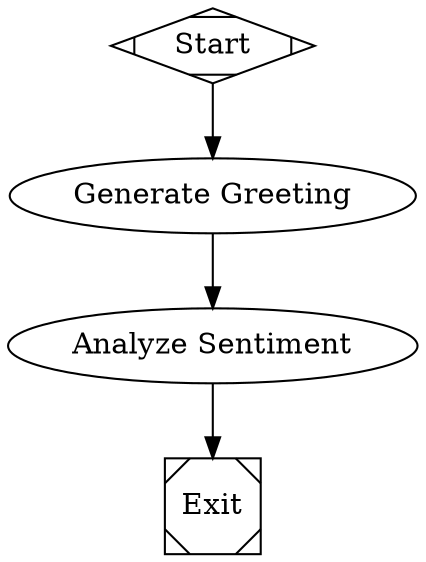
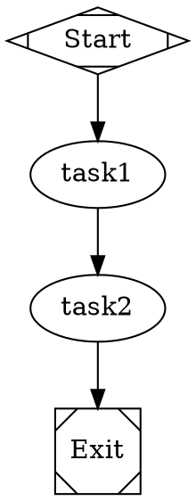
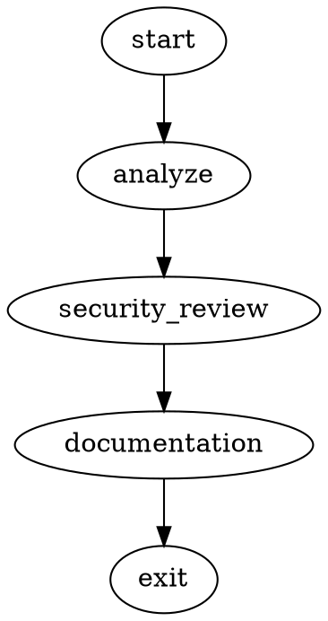

# Attractor

A DOT-based pipeline runner that uses directed graphs (defined in Graphviz DOT syntax) to orchestrate multi-stage AI workflows. Each node in the graph is an AI task (LLM call, human review, conditional branch, parallel fan-out, etc.) and edges define the flow between them.

## Overview

Attractor solves the problem of orchestrating multi-stage AI workflows by letting pipeline authors define workflows as directed graphs using Graphviz DOT syntax. The graph is the workflow: nodes are tasks, edges are transitions, and attributes configure behavior.

### Key Features

- **Declarative Pipelines**: Define workflows as DOT graphs - visual, version-controllable, and human-readable
- **Multi-Provider AI**: Access 100+ models from OpenAI, Anthropic, Google, xAI, and more through Kilo Gateway
- **Smart Model Routing**: Automatic selection of optimal AI models based on task complexity and cost
- **Human-in-the-Loop**: Built-in support for approval gates and manual oversight
- **Checkpoint & Resume**: Automatic checkpointing enables crash recovery and resume
- **Advanced Validation**: Pre-execution linting prevents runtime errors
- **Edge-based Routing**: Sophisticated routing based on conditions, labels, and weights

## Quick Start

### Installation

```bash
npm install attractor
```

### Get AI Access (Recommended: Kilo Gateway)

1. Visit [app.kilo.ai](https://app.kilo.ai) and get your API key
2. Set up environment:

```bash
export KILO_API_KEY="your-api-key-here"
export KILO_CONFIG="balanced"  # budget|balanced|performance
```

### Your First Workflow

Create `hello-world.dot`:



Run it:

```bash
# Using Kilo Gateway (recommended - 100+ models)
node run-with-kilo.js hello-world.dot

# Or with direct provider
node -e "
import('./src/index.js').then(async ({ Attractor }) => {
  const attractor = await Attractor.create();
  const result = await attractor.run('./hello-world.dot');
  console.log('Success:', result.success);
});
"
```

### Directory-based Workflows

The Attractor system also supports workflows defined as directories, which allows for more organized and maintainable workflow definitions:

```
workflow-directory/
├── workflow.dot          # Main DOT file containing the workflow graph
└── prompts/              # Directory containing prompt files
    ├── node1.txt         # Prompt for node1
    ├── node2.txt         # Prompt for node2
    └── ...
```

You can now run workflows using either:
1. A direct DOT file:
   ```bash
   node run.js path/to/workflow.dot
   ```

2. A directory containing a workflow.dot and prompts:
   ```bash
   node run.js path/to/workflow-directory
   ```

This feature enables you to separate your DOT workflow definition from long prompt texts, making workflows more readable and maintainable.

### Pre-built Workflows

Try comprehensive workflows on your codebase:

```bash
# Comprehensive code analysis (security, performance, quality)
node run-with-kilo.js workflows/comprehensive-code-analysis.dot ./my-project

# Generate complete documentation
node run-with-kilo.js workflows/documentation-suite.dot ./my-project

# Create comprehensive test suite
node run-with-kilo.js workflows/testing-pipeline.dot ./my-project
```

## Architecture

Attractor is built on three foundational layers:

### 1. Unified LLM Client
- **Multi-Provider Support**: OpenAI, Anthropic, Google Gemini, xAI Grok via Kilo Gateway
- **Smart Model Routing**: Automatic selection based on task complexity and cost
- **Cost Management**: Real-time tracking, budgets, and optimization
- **Streaming & Tools**: Full streaming support and tool calling capabilities

### 2. Coding Agent Loop
- **Autonomous Execution**: AI agents with developer tools (file ops, code execution)
- **Context Management**: Conversation history and state across workflow steps
- **Tool Integration**: File operations, shell commands, external APIs
- **Loop Detection**: Prevents infinite cycles and manages output truncation

### 3. Pipeline Orchestration
- **DOT Parsing**: Full Graphviz DOT subset with sophisticated graph analysis
- **Edge-based Routing**: Conditional branching, retry logic, parallel execution
- **Human Gates**: Built-in approval processes with customizable interfaces
- **Checkpointing**: Crash recovery and resume from any point

## Essential DOT Syntax

### Graph Structure
Every pipeline needs exactly one start and one exit node:



### Node Types by Shape

| Shape | Handler | Purpose |
|-------|---------|---------|
| `Mdiamond` | `start` | Pipeline entry point |
| `Msquare` | `exit` | Pipeline termination |
| `box` (default) | `codergen` | AI-powered tasks |
| `hexagon` | `wait.human` | Human approval gates |
| `diamond` | `conditional` | Branching logic |
| `parallelogram` | `tool` | External tool execution |
| `component` | `parallel` | Parallel branch execution |
| `tripleoctagon` | `parallel.fan_in` | Branch consolidation |

### Common Patterns

**Linear Workflow:**
```dot
start -> analyze -> implement -> test -> deploy -> exit
```

**Conditional Branching:**
```dot
validate -> success [condition="outcome=success"]
validate -> fix [condition="outcome!=success"]
fix -> validate  // Retry loop
```

**Human Approval:**
```dot
review_gate [shape=hexagon, label="Code Review"]
review_gate -> deploy [label="[A] Approve"]
review_gate -> revise [label="[R] Request Changes"]
```

## Smart Model Configuration

Use CSS-like stylesheets to configure AI models:



## Cost Management

### Budget Controls
```bash
# Set daily budget limit
export KILO_COST_BUDGET="5.00"  # $5 daily limit

# Choose cost profile
export KILO_CONFIG="budget"     # Optimized for cost
export KILO_CONFIG="balanced"   # Recommended: performance/cost balance  
export KILO_CONFIG="performance" # Maximum quality
```

### Usage Monitoring
All workflows automatically track:
- Cost breakdown by model and task
- Performance metrics and success rates  
- Efficiency recommendations
- Budget alerts and forecasting

View reports in `./logs/usage-tracking.json`

## Event-Driven Monitoring

```javascript
import { Attractor } from 'attractor';

const attractor = await Attractor.create();

// Pipeline lifecycle
attractor.on('pipeline_start', ({ runId, dotFile }) => {
  console.log(`Starting: ${dotFile}`);
});

attractor.on('node_execution_success', ({ nodeId, outcome }) => {
  console.log(`✅ ${nodeId}: ${outcome.message}`);
});

attractor.on('pipeline_complete', ({ success, duration }) => {
  console.log(`Completed in ${duration}ms: ${success ? '✅' : '❌'}`);
});

const result = await attractor.run('./my-workflow.dot');
```

## Human-in-the-Loop

Add human oversight at critical decision points:

```dot
security_gate [
    shape=hexagon,
    label="Security Review Required"
]

security_gate -> deploy [label="[A] Approve for production"]
security_gate -> staging [label="[S] Deploy to staging first"] 
security_gate -> reject [label="[R] Reject - security issues"]
```

Interactive prompts appear in terminal or can integrate with web UIs.

## Validation & Testing

### Pre-execution Validation
```bash
# Validate before running
node -e "
import('./src/index.js').then(async ({ Attractor }) => {
  const attractor = await Attractor.create();
  const issues = await attractor.validate('./my-workflow.dot');
  console.log('Validation issues:', issues.length);
});
"
```

### Simulation Mode
Test workflows without API costs:

```javascript
const attractor = await Attractor.create({
  llm: { simulation: true }  // Mock AI responses
});
```

## What Attractor Enables

### For Individual Developers
- **Automated Code Review**: AI-powered analysis in minutes instead of hours
- **Documentation Generation**: Professional docs with zero manual writing
- **Testing Assistance**: Comprehensive test suites generated automatically
- **Learning Tool**: Best practices through AI recommendations

### For Teams  
- **Consistent Quality**: Standardized AI-powered review across all projects
- **Knowledge Sharing**: Capture team coding standards in reusable workflows
- **Onboarding**: New members get AI guidance and mentoring
- **Productivity**: Automate routine development tasks

### For Organizations
- **Cost Control**: Built-in budget management and usage analytics
- **Compliance**: Audit trails and approval processes for regulations
- **Scalability**: Apply consistent workflows across hundreds of projects
- **ROI Tracking**: Detailed metrics on AI efficiency and benefits

## Example Use Cases

- **Code Review Pipeline**: Analyze → Security audit → Performance check → Human approval → Deploy
- **Testing Workflow**: Generate tests → Run coverage → Analyze gaps → Create additional tests
- **Documentation Suite**: Code analysis → API docs → User guides → Review → Publish  
- **Security Audit**: Scan vulnerabilities → Generate patches → Human review → Apply fixes
- **Feature Development**: Plan → Implement → Test → Review → Deploy with gates

Attractor excels at workflows requiring multiple AI reasoning steps, human oversight, robust error handling, and audit trails.

## Documentation

### User Guides
- **[Getting Started](docs/getting-started.md)** - Installation, first workflow, essential concepts
- **[Kilo Integration](docs/kilo-integration.md)** - Access 100+ AI models with cost control  
- **[Advanced Features](docs/advanced-features.md)** - Complex workflows, custom handlers, validation

### Developer Resources  
- **[Developer Guide](docs/developer-guide.md)** - Architecture, extending Attractor, contributing
- **[API Reference](docs/api-reference.md)** - Complete API documentation

### Examples

Check the `examples/` and `workflows/` directories for complete working examples:
- `examples/simple-linear.dot` - Basic sequential workflow
- `examples/branching-workflow.dot` - Conditional logic and retry loops  
- `examples/directory-workflow/` - Directory-based workflow with separate prompt files
- `workflows/comprehensive-code-analysis.dot` - Complete code analysis pipeline
- `workflows/documentation-suite.dot` - Full documentation generation

## Contributing

Attractor implements the [StrongDM Attractor Specification](https://github.com/strongdm/attractor). Contributions should align with these design principles:

- **Declarative pipelines** over imperative scripts
- **Pluggable handlers** for extensibility  
- **Edge-based routing** for sophisticated control flow
- **Provider-agnostic** AI integration
- **Event-driven** architecture for observability

See the [Developer Guide](docs/developer-guide.md) for architecture details and contribution guidelines.

## License

Apache-2.0 - See [LICENSE](LICENSE) file for details.

## Related Projects

- [StrongDM Attractor Spec](https://github.com/strongdm/attractor) - The specification this implements
- [Kilo Gateway](https://kilo.ai) - Access to 100+ AI models with unified API
- [Graphviz](https://graphviz.org/) - For visualizing DOT workflows