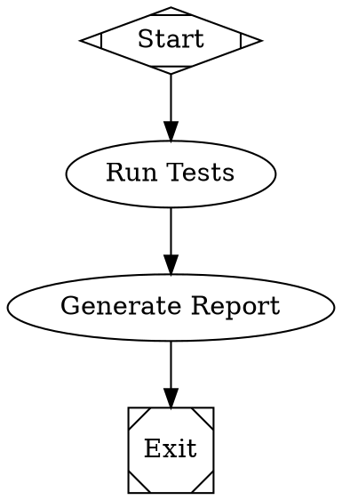
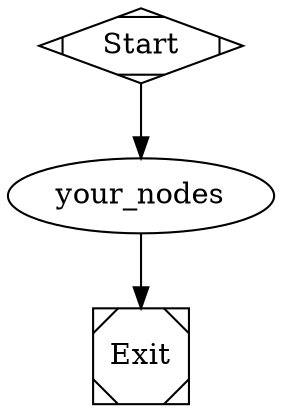

# Attractor

A DOT-based pipeline runner that uses directed graphs (defined in Graphviz DOT syntax) to orchestrate multi-stage AI workflows. Each node in the graph is an AI task (LLM call, human review, conditional branch, parallel fan-out, etc.) and edges define the flow between them.

## Overview

Attractor solves the problem of orchestrating multi-stage AI workflows by letting pipeline authors define workflows as directed graphs using Graphviz DOT syntax. The graph is the workflow: nodes are tasks, edges are transitions, and attributes configure behavior.

### Key Features

- **Declarative Pipelines**: Define workflows as DOT graphs - visual, version-controllable, and human-readable
- **Pluggable Handlers**: Each node type is backed by a handler implementing a common interface
- **Checkpoint & Resume**: Automatic checkpointing enables crash recovery and resume
- **Human-in-the-Loop**: Built-in support for approval gates and manual oversight
- **Edge-based Routing**: Sophisticated routing based on conditions, labels, and weights
- **Unified LLM Client**: Provider-agnostic interface supporting OpenAI, Anthropic, Gemini, and more

> 📚 **See the [Documentation](#documentation) section below for comprehensive guides and implementation details.**

## Quick Start

### Installation

```bash
npm install attractor
```

### Basic Usage

```javascript
import { Attractor } from 'attractor';

// Create an Attractor instance
const attractor = await Attractor.create();

// Set up event listeners
attractor.on('pipeline_start', ({ runId }) => {
  console.log(`Pipeline started: ${runId}`);
});

attractor.on('node_execution_success', ({ nodeId, outcome }) => {
  console.log(`Node completed: ${nodeId}`);
});

// Run a pipeline
const result = await attractor.run('./my-workflow.dot');
console.log('Pipeline result:', result);
```

### Simple Pipeline Example

Create a file called `simple-workflow.dot`:



## DOT Pipeline Syntax

### Graph Structure

Every pipeline must be a `digraph` (directed graph) with exactly one start node and one exit node:



### Node Types (by Shape)

| Shape | Handler Type | Description |
|-------|-------------|-------------|
| `Mdiamond` | `start` | Pipeline entry point |
| `Msquare` | `exit` | Pipeline exit point |
| `box` | `codergen` | LLM task (default for all nodes) |
| `hexagon` | `wait.human` | Human-in-the-loop gate |
| `diamond` | `conditional` | Conditional routing |
| `component` | `parallel` | Parallel fan-out |
| `tripleoctagon` | `parallel.fan_in` | Parallel fan-in |
| `parallelogram` | `tool` | External tool execution |

### Common Node Attributes

```dot
my_node [
    label="Display Name",
    prompt="LLM instruction text with $goal variable",
    max_retries=3,
    timeout="900s",
    goal_gate=true
]
```

### Edge Attributes

```dot
node1 -> node2 [
    label="Edge Label",
    condition="outcome=success",
    weight=10
]
```

## Architecture

Attractor is built on three foundational layers:

### 1. Unified LLM Client

Provider-agnostic interface supporting:
- **OpenAI**: GPT-4.1, GPT-5.2 series (via Responses API)
- **Anthropic**: Claude Opus 4.6, Sonnet 4.5 (with extended thinking)
- **Google**: Gemini 3 Pro/Flash (with grounding)

```javascript
import { Client } from 'attractor';

const client = await Client.fromEnv();
const response = await client.complete({
  model: 'claude-opus-4-6',
  messages: [{ role: 'user', content: 'Hello!' }]
});
```

### 2. Coding Agent Loop

Autonomous agentic loop that:
- Pairs LLMs with developer tools
- Handles tool execution and context management  
- Supports steering and follow-up messages
- Implements loop detection and output truncation

```javascript
import { Session, SessionConfig } from 'attractor';

const session = new Session(providerProfile, executionEnv, config, llmClient);
await session.processInput('Fix the login bug');
```

### 3. Pipeline Orchestration

DOT-based workflow engine that:
- Parses Graphviz DOT files into executable graphs
- Traverses nodes with sophisticated edge selection
- Manages context and checkpointing
- Supports retry policies and failure routing

## Advanced Features

### Conditional Routing

```dot
validate -> gate [condition="outcome=success"]
gate -> deploy [label="Success", condition="outcome=success"]  
gate -> fix [label="Failed", condition="outcome!=success"]
```

### Goal Gates

Mark critical nodes that must succeed:

```dot
deploy [goal_gate=true, prompt="Deploy to production"]
```

### Retry Policies

```dot
flaky_task [max_retries=5, retry_target="fallback_node"]
```

### Human Gates

```dot
review [
    shape=hexagon,
    label="Review Changes"
]

review -> approve [label="[A] Approve"]
review -> reject  [label="[R] Request Changes"]
```

## Examples

Check the `examples/` directory for complete workflows:

- `simple-linear.dot` - Basic sequential workflow
- `branching-workflow.dot` - Conditional branching with retry loops
- `demo.js` - JavaScript example showing API usage

## API Reference

### Attractor Class

```javascript
const attractor = await Attractor.create(options);
```

**Methods:**
- `run(dotFilePath, options)` - Execute a pipeline
- `on(event, listener)` - Listen to pipeline events  
- `registerHandler(type, handler)` - Register custom node handlers

**Events:**
- `pipeline_start` - Pipeline execution begins
- `node_execution_start` - Node begins execution
- `node_execution_success` - Node completes successfully
- `edge_traversed` - Pipeline moves to next node
- `pipeline_complete` - Pipeline finishes

### Pipeline Context

Thread-safe key-value store for sharing data between nodes:

```javascript
context.set('key', 'value');
const value = context.get('key', 'default');
```

**Built-in Keys:**
- `outcome` - Last node's execution status
- `graph.goal` - Pipeline goal from DOT file
- `current_node` - Currently executing node ID
- `last_response` - Truncated last LLM response

### Custom Handlers

Implement the Handler interface to create custom node types:

```javascript
import { Handler, Outcome } from 'attractor';

class MyHandler extends Handler {
  async execute(node, context, graph, logsRoot) {
    // Custom logic here
    return Outcome.success('Custom task completed');
  }
}

attractor.registerHandler('my_type', new MyHandler());
```

## What Attractor Does

Attractor is a **workflow orchestration system** specifically designed for AI-powered software development pipelines. Here's what it enables:

### 1. **Multi-Stage AI Workflows**
- Chain together multiple LLM calls with different prompts and contexts
- Pass data between stages through a shared context system
- Handle complex branching logic based on AI responses

### 2. **Visual Workflow Definition**
- Define workflows as DOT graphs that can be visualized with Graphviz
- Version control your workflows like code
- Share and review workflow logic visually

### 3. **Robust Execution**
- Automatic checkpointing and resume after crashes
- Configurable retry policies with exponential backoff
- Sophisticated error handling and failure routing

### 4. **Human Oversight**
- Built-in human approval gates for critical decisions
- Manual steering to redirect workflows mid-execution
- Audit trails and execution logs for compliance

### 5. **Provider Flexibility**
- Use different AI models for different stages
- Switch providers without changing workflow logic
- Leverage provider-specific features (reasoning tokens, thinking, etc.)

### Example Use Cases

- **Code Review Pipeline**: Analyze code → Generate review → Human approval → Apply fixes
- **Testing Workflow**: Run tests → Analyze failures → Generate fixes → Validate fixes  
- **Documentation Pipeline**: Analyze code → Generate docs → Review → Publish
- **Security Audit**: Scan code → Identify issues → Generate patches → Human review
- **Feature Development**: Plan → Implement → Test → Deploy with approval gates

Attractor excels at workflows where you need:
- Multiple AI reasoning steps with different contexts
- Human oversight and approval processes  
- Robust error handling and retry logic
- Visual representation of complex workflows
- Audit trails and compliance requirements

It's particularly valuable for "software factory" scenarios where AI agents perform software development tasks that require structured, repeatable, and auditable processes.

## Documentation

Additional documentation is available in the `docs/` directory:

- **[Kilo Integration Guide](docs/KILO_INTEGRATION_GUIDE.md)** - Complete guide for using Attractor with Kilo Gateway to access hundreds of AI models
- **[Kilo Implementation Summary](docs/KILO_IMPLEMENTATION_SUMMARY.md)** - Technical details of the Kilo Gateway integration implementation
- **[Implementation Summary](docs/IMPLEMENTATION_SUMMARY.md)** - Detailed overview of the complete Attractor implementation
- **[Final Completion Report](docs/FINAL_COMPLETION_REPORT.md)** - Comprehensive completion status and feature checklist

## Contributing

Attractor is implemented according to the [StrongDM Attractor Specification](https://github.com/strongdm/attractor). Contributions should align with the specification's design principles:

- **Declarative pipelines** over imperative scripts
- **Pluggable handlers** for extensibility  
- **Edge-based routing** for sophisticated control flow
- **Provider-agnostic** LLM integration

## License

Apache-2.0 - See [LICENSE](LICENSE) file for details.

## Related Projects

- [StrongDM Attractor Spec](https://github.com/strongdm/attractor) - The specification this implements
- [Graphviz](https://graphviz.org/) - For visualizing DOT workflows
- [OpenAI API](https://platform.openai.com/) - LLM provider
- [Anthropic Claude](https://www.anthropic.com/) - LLM provider  
- [Google Gemini](https://ai.google.dev/) - LLM provider