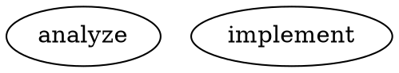
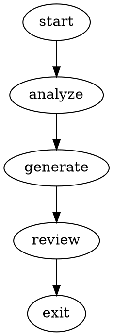
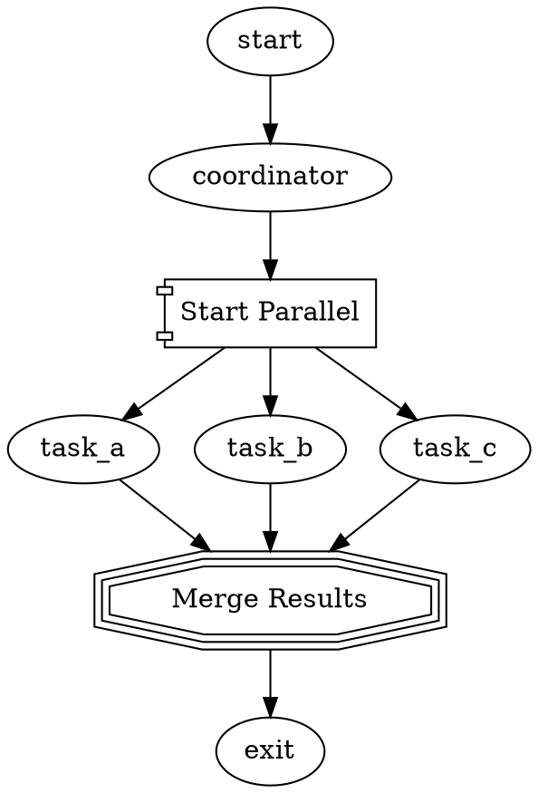
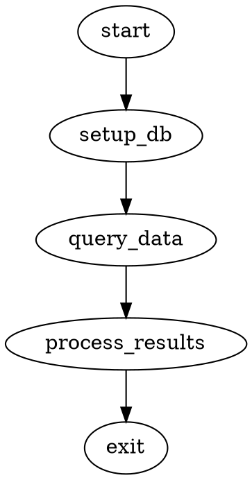

# Advanced Features

This guide covers advanced Attractor features for sophisticated workflow orchestration.

## Advanced DOT Syntax

### Goal Gates ✅ **Implemented**

Mark critical nodes that must succeed for the pipeline to be considered successful:

```dot
deploy [
    goal_gate=true,
    prompt="Deploy to production with verification",
    max_retries=3,
    retry_target="rollback"
]
```

If a goal gate fails after all retries, the entire pipeline fails.

### Retry Policies ✅ **Implemented**

Configure sophisticated retry behavior:

```dot
flaky_operation [
    label="Potentially Unstable Operation",
    prompt="Perform network operation that might fail",
    max_retries=5,
    retry_target="fallback_handler",
    timeout="60s"
]

fallback_handler [
    prompt="Handle the failure and provide alternative approach"
]

flaky_operation -> success [condition="outcome=success"]
flaky_operation -> fallback_handler [condition="outcome=failure"]
```

### Edge Weights and Preferences ✅ **Implemented**

Control routing preferences with edge weights:

```dot
validate -> fast_deploy [weight=10, condition="outcome=success AND confidence>0.8"]
validate -> thorough_test [weight=5, condition="outcome=success"]
validate -> manual_review [weight=1, condition="outcome=success"]
```

Higher weights are preferred when multiple conditions match.

### Variable Expansion ✅ **Implemented**

Use context variables in prompts:



Built-in variables:
- `$goal` - The graph's goal attribute ✅
- `$last_response` - Previous node's response (truncated) ✅
- `$current_node` - Currently executing node ID ✅
- `$<nodeId>.output` - Previous node's output ✅
- `$context.<key>` - Arbitrary context keys ✅
- `$env.VAR` - Environment variables ✅

## Model Stylesheets ✅ **Fully Implemented**

Configure AI models using CSS-like syntax for different node types.

### Basic Stylesheet



### Selector Types

- **Universal**: `* { model: gpt-4o; }`
- **Class**: `.analysis { model: claude-3-5-sonnet; }`
- **ID**: `#important { reasoning_effort: high; }`
- **Shape**: `hexagon { timeout: 300s; }`
- **Attribute**: `[goal_gate="true"] { max_retries: 5; }`

### Predefined Stylesheets

```javascript
import { Attractor, PredefinedStylesheets } from 'attractor';

const attractor = await Attractor.create({
    engine: {
        stylesheet: PredefinedStylesheets.balanced()
        // Options: .budget(), .performance(), .multiProvider()
    }
});
```

## Human-in-the-Loop Patterns ✅ **Fully Implemented**

### Multiple Choice Gates

```dot
review_gate [
    shape=hexagon,
    label="Code Review Decision"
]

review_gate -> approve [label="[A] Approve - Deploy"]
review_gate -> minor_fixes [label="[M] Minor fixes needed"]  
review_gate -> major_changes [label="[R] Major changes required"]
review_gate -> reject [label="[X] Reject completely"]
```

### Timeout with Defaults

```dot
urgent_review [
    shape=hexagon,
    label="Urgent Review (auto-approve in 5min)",
    timeout="300s",
    default_choice="approve"
]
```

### Custom Interviewers ✅ **Implemented**

```javascript
import { Attractor, WebInterviewer } from 'attractor';

const attractor = await Attractor.create({
    human: {
        interviewer: new WebInterviewer({
            port: 8080,
            baseUrl: 'http://localhost:8080'
        })
    }
});
```

## Validation and Linting ✅ **Implemented**

### Built-in Validation Rules

Attractor includes comprehensive validation:

```javascript
import { PipelineLinter } from 'attractor';

const validator = new PipelineLinter();
const issues = await validator.validate(dotContent);

// Check validation results
const errors = issues.filter(i => i.severity === 'error');
const warnings = issues.filter(i => i.severity === 'warning');

if (errors.length > 0) {
    console.log('Validation errors found:');
    errors.forEach(e => console.log(`- ${e.message}`));
}
```

### Validation Rules Include

1. **Graph Structure**: Start/exit nodes, connectivity
2. **Node Configuration**: Valid handlers, required attributes  
3. **Edge Conditions**: Syntax, reachability
4. **Goal Gates**: Retry target validation
5. **Timeouts**: Valid duration formats
6. **Human Gates**: Proper edge labeling
7. **Cycles**: Deadlock detection
8. **Orphans**: Unreachable nodes
9. **Syntax**: DOT parser validation
10. **Handlers**: Registered handler types
11. **Stylesheets**: CSS syntax validation
12. **References**: Valid node/edge references

## Parallel Execution ✅ **Implemented**

### Fan-out and Fan-in



### Conditional Parallel Paths

```dot
analysis -> light_path [condition="complexity=low"]
analysis -> heavy_path [condition="complexity=high"]

light_path -> quick_review -> merge
heavy_path -> thorough_analysis -> detailed_review -> merge

merge [shape=tripleoctagon]
```

## Checkpointing and Resume ✅ **Implemented**

### Automatic Checkpointing

```javascript
const attractor = await Attractor.create({
    engine: {
        enableCheckpointing: true,
        checkpointDir: './checkpoints'
    }
});

// Pipeline automatically saves state at each node
const result = await attractor.run('./long-workflow.dot');
```

### Manual Resume

```javascript
// Resume from checkpoint using run ID
const result = await attractor.resume('pipeline-abc123', {
    timeout: 3600000
});

// List available checkpoints
const checkpoints = await Attractor.listCheckpoints({
    logsRoot: './logs'
});
```

### Checkpoint Events

```javascript
attractor.on('pipeline_resume', ({ runId, checkpoint }) => {
    console.log(`Resuming from checkpoint: ${checkpoint}`);
});

attractor.on('pipeline_resume_complete', ({ runId, success, resumedFrom }) => {
    console.log(`Resume complete: ${success}, resumed from ${resumedFrom}`);
});
```

## Custom Node Handlers ✅ **Fully Implemented**

### Creating Custom Handlers

```javascript
import { Handler, Outcome } from 'attractor';

class DatabaseHandler extends Handler {
    async execute(node, context, graph, logsRoot) {
        const query = node.attributes.query;
        const connection = context.get('db_connection');
        
        try {
            const results = await connection.execute(query);
            context.set('query_results', results);
            
            return Outcome.success('Database query completed', {
                rowCount: results.length,
                query: query
            });
        } catch (error) {
            return Outcome.failure(`Database error: ${error.message}`, {
                query: query,
                error: error.message
            });
        }
    }
}

// Register the custom handler
const attractor = await Attractor.create();
attractor.registerHandler('database', new DatabaseHandler());
```

### Using Custom Handlers



## Advanced Context Management ✅ **Implemented**

### Context Scoping

```javascript
// Set scoped context data
context.set('user.preferences', { theme: 'dark', lang: 'en' });
context.set('session.timeout', 3600);

// Access with defaults
const theme = context.get('user.preferences.theme', 'light');
const timeout = context.get('session.timeout', 1800);

// Type-safe accessors
const prefs = context.getObject('user.preferences', {});
const items = context.getArray('items', []);
const count = context.getNumber('item_count', 0);
const enabled = context.getBoolean('feature_enabled', false);
```

### Session Export/Import

```javascript
// Export full session state
const session = context.exportSession();
// Returns: { version, exportedAt, values, logs }

// Import session state
context.importSession(sessionData);
```

### Environment Variables

```javascript
// Access environment variables
const apiKey = context.getEnv('API_KEY');
const dbUrl = context.getEnvString('DATABASE_URL', 'localhost:5432');
const hasKey = context.hasEnv('SECRET_KEY');
```

### Secret Masking ✅ **Implemented**

Environment variables matching `*_SECRET`, `*_KEY`, `*_TOKEN`, `*_PASSWORD` are automatically masked in logs:

```javascript
process.env.API_SECRET = 'my-secret-key';
context.appendLog('Using API_SECRET for authentication');
// Log entry: "Using ****** for authentication"
```

## Performance Optimization

### Simulation Mode ✅ **Implemented**

Test workflows without API calls:

```javascript
const attractor = await Attractor.create({
    llm: {
        simulation: true  // Use mock responses
    }
});
```

### Caching

LLM response caching is built into the Kilo adapter. Additional caching options:

```javascript
const attractor = await Attractor.create({
    llm: {
        enableCaching: true,
        cacheDir: './cache',
        cacheTTL: 3600
    }
});
```

### Concurrent Execution ✅ **Implemented**

```javascript
const attractor = await Attractor.create({
    engine: {
        maxConcurrentNodes: 3
    }
});
```

## Integration Patterns

### CI/CD Integration

```yaml
# .github/workflows/attractor.yml
name: AI Code Review
on: [pull_request]

jobs:
  ai-review:
    runs-on: ubuntu-latest
    steps:
      - uses: actions/checkout@v3
      - name: Run Attractor Analysis
        env:
          KILO_API_KEY: ${{ secrets.KILO_API_KEY }}
        run: |
          node run-with-kilo.js workflows/pr-review.dot ./
```

### Web Service Integration

```javascript
import express from 'express';
import { Attractor } from 'attractor';

const app = express();
const attractor = await Attractor.create();

app.post('/api/workflows/:name', async (req, res) => {
    try {
        const result = await attractor.run(`./workflows/${req.params.name}.dot`, {
            context: req.body.context
        });
        res.json(result);
    } catch (error) {
        res.status(500).json({ error: error.message });
    }
});
```

### Event-Driven Architecture

```javascript
import { EventEmitter } from 'events';

class WorkflowOrchestrator extends EventEmitter {
    constructor() {
        super();
        this.attractor = await Attractor.create();
        this.setupEventHandlers();
    }
    
    setupEventHandlers() {
        this.attractor.on('pipeline_complete', (data) => {
            this.emit('workflow_finished', data);
        });
        
        this.attractor.on('node_execution_success', (data) => {
            if (data.nodeId === 'notification_gate') {
                this.emit('send_notification', data.outcome.data);
            }
        });
    }
}
```

## Best Practices

### Workflow Design
- Keep individual nodes focused on single responsibilities
- Use meaningful node IDs and labels
- Include retry logic for external operations
- Add human gates for critical decisions
- Use goal gates to define success criteria

### Error Handling
- Always provide retry targets for important operations
- Use validation to catch issues before execution
- Implement graceful degradation paths
- Log context at failure points

### Performance
- Use simulation mode for development and testing
- Cache expensive operations when possible
- Limit parallel execution based on API rate limits
- Monitor token usage and costs

### Security
- Validate all external inputs
- Use environment variables for API keys
- Implement audit logging for compliance
- Review human gate decisions in sensitive workflows