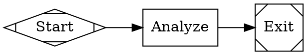

# Directory-based Workflows

The Attractor system now supports workflows defined as directories, which allows for more organized and maintainable workflow definitions. This feature enables you to separate your DOT workflow definition from long prompt texts.

## Directory Structure

A directory-based workflow follows this structure:

```
workflow-directory/
├── workflow.dot          # Main DOT file containing the workflow graph
└── prompts/              # Directory containing prompt files
    ├── node1.txt         # Prompt for node1
    ├── node2.txt         # Prompt for node2
    └── ...
```

## Usage

You can now run workflows using either:

1. A direct DOT file:
   ```bash
   node run.js path/to/workflow.dot
   ```

2. A directory containing a workflow.dot and prompts:
   ```bash
   node run.js path/to/workflow-directory
   ```

## Benefits

- **Separation of concerns**: Keep your DOT graph structure separate from long prompt texts
- **Better organization**: Prompts are stored in a dedicated directory
- **Improved readability**: DOT files become more readable without large prompt content
- **Version control friendly**: Each prompt can be tracked separately in version control

## Example

For a workflow directory with a `workflow.dot` file and a `prompts/` subdirectory:

**workflow.dot:**


**prompts/analyze.txt:**
```
Analyze the following data: $data
```

The system will automatically inject the prompt from the text file into the corresponding node's prompt attribute.