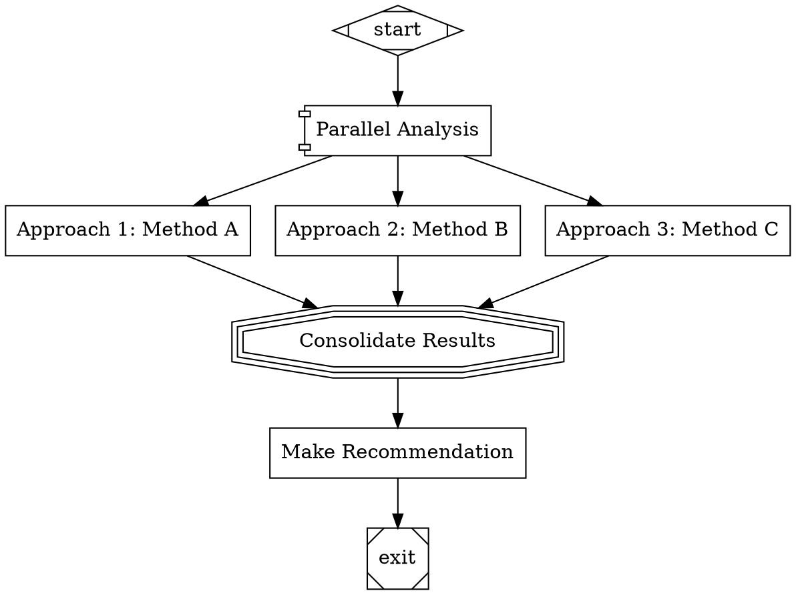

# FanIn Handler

The FanIn Handler consolidates results from multiple parallel branches into a single unified output using LLM capabilities. This handler is designed to work in conjunction with the Parallel Handler to create powerful branching and consolidation workflows.

## Node Attributes

| Attribute | Type | Required | Description |
|-----------|------|----------|-------------|
| `prompt` | string | No | Consolidation prompt (default: "Consolidate the following results:") |
| `model` | string | No | Override LLM model |
| `temperature` | number | No | LLM temperature setting |
| `max_tokens` | number | No | Maximum response tokens |

## Usage Example



## Context Keys

| Key | Type | Description | Source |
|-----|------|-------------|--------|
| `<source_node_id>.output` | string | Output from source branch | Branch execution |
| `<fanin_node_id>.output` | string | Consolidated result | FanIn handler |
| `fanin.branch_count` | number | Number of branches consolidated | FanIn handler |
| `last_response` | string | Consolidated result (standard key) | FanIn handler |

## Variable Expansion

The FanIn handler supports the same variable expansion patterns as the Codergen handler:

- `$goal` - Expands to the graph goal
- `$last_response` - Expands to the last response in context
- `$<node_id>.output` - Expands to the output from a specific node

## Logging

The FanIn Handler creates a log structure for each execution:

```
logs/
└── <fanin_node_id>/
    ├── prompt.md              # Consolidation prompt
    ├── response.md            # LLM consolidated response
    ├── outcome.json           # Outcome status and metadata
    └── error.txt              # Error details (on failure)
```

## Processing Flow

1. **Edge Discovery**: Identifies all incoming edges to determine source branches
2. **Output Collection**: Reads branch outputs from context using `<node_id>.output` keys
3. **Prompt Construction**: Builds a structured prompt with all branch results
4. **LLM Processing**: Sends the prompt to the LLM backend for consolidation
5. **Result Storage**: Stores the consolidated result in context for downstream nodes

## Error Handling

- **Missing Outputs**: Logs warnings for missing branch outputs, continues with available data
- **Backend Errors**: Catches errors from the LLM backend and returns failure outcomes
- **Simulation Mode**: When no backend is configured, generates simulated responses

## Implementation Details

The FanIn Handler uses the same backend interface as the CodergenHandler and supports the same variable expansion patterns, making it consistent with the rest of the system.