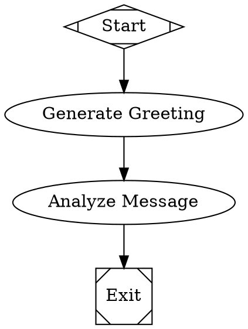
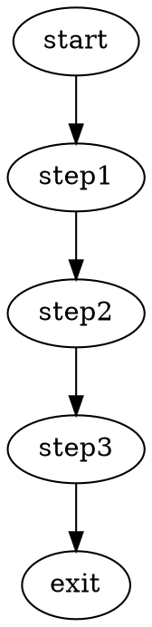
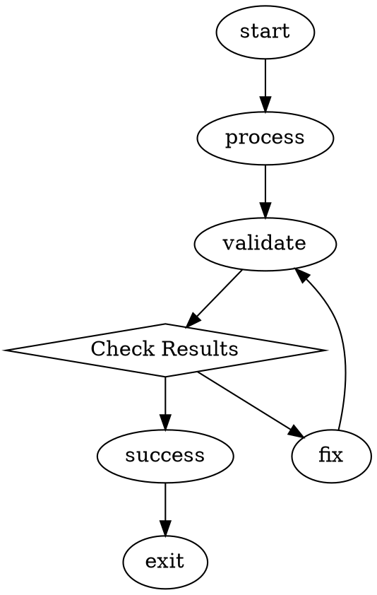
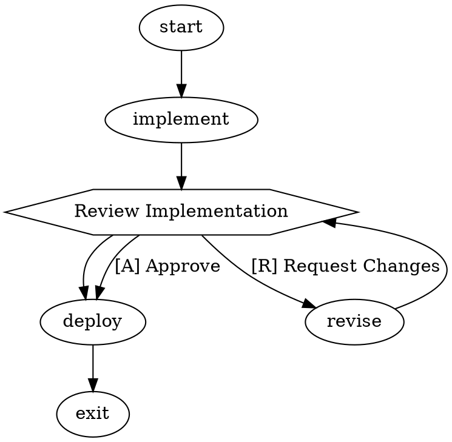

# Getting Started with Attractor

Attractor is a DOT-based pipeline runner that orchestrates multi-stage AI workflows. This guide will get you up and running quickly.

## Installation

```bash
npm install attractor
```

## Your First Workflow

### 1. Create a Simple DOT File

Create a file called `hello-world.dot`:



### 2. Run Your First Pipeline

```javascript
import { Attractor } from 'attractor';

// Create an Attractor instance
const attractor = await Attractor.create();

// Set up event listeners
attractor.on('pipeline_start', ({ runId }) => {
  console.log(`Pipeline started: ${runId}`);
});

attractor.on('node_execution_success', ({ nodeId, outcome }) => {
  console.log(`Node completed: ${nodeId}`);
});

// Run the pipeline
const result = await attractor.run('./hello-world.dot');
console.log('Pipeline result:', result);
```

## Essential Concepts

### DOT Graph Structure

Every Attractor pipeline is a directed graph with:
- **Exactly one start node**: `[shape=Mdiamond]`
- **Exactly one exit node**: `[shape=Msquare]`  
- **Task nodes**: Regular nodes that perform work
- **Edges**: Define the flow between nodes

### Node Types by Shape

| Shape | Purpose | Description |
|-------|---------|-------------|
| `Mdiamond` | Start | Pipeline entry point |
| `Msquare` | Exit | Pipeline termination |
| `box` (default) | LLM Task | AI-powered work |
| `hexagon` | Human Gate | Requires human approval |
| `diamond` | Conditional | Branching logic |
| `parallelogram` | Tool | External tool execution |

### Basic Node Attributes

```dot
my_task [
    label="Display Name",
    prompt="Instructions for the AI agent",
    max_retries=3,
    timeout="900s"
]
```

### Edge Conditions

```dot
validate -> success [condition="outcome=success"]
validate -> retry [condition="outcome!=success"]
```

## Common Patterns

### Linear Workflow


### Conditional Branching


### Human Approval Gate


## Configuration Options

### Basic Configuration
```javascript
const attractor = await Attractor.create({
    // LLM provider settings
    llm: {
        provider: 'anthropic',  // or 'openai', 'kilo'
        model: 'claude-3-5-sonnet-20241022'
    },
    
    // Execution options  
    engine: {
        enableValidation: true,
        enableCheckpointing: true
    }
});
```

### Environment Variables
```bash
# Anthropic
export ANTHROPIC_API_KEY="your-key"

# OpenAI  
export OPENAI_API_KEY="your-key"

# Kilo Gateway (access to 100+ models)
export KILO_API_KEY="your-key"
```

## Running Workflows

### Command Line
```bash
# Basic execution
node -e "
import('./src/index.js').then(async ({ Attractor }) => {
  const attractor = await Attractor.create();
  const result = await attractor.run('./my-workflow.dot');
  console.log('Result:', result.success);
});
"
```

### With Kilo Integration (Recommended)
```bash
export KILO_API_KEY="your-key"
node run-with-kilo.js workflows/comprehensive-code-analysis.dot ./my-project
```

## Monitoring and Events

### Event Listening
```javascript
// Pipeline lifecycle
attractor.on('pipeline_start', ({ runId, dotFile }) => {
  console.log(`Starting pipeline: ${dotFile}`);
});

attractor.on('pipeline_complete', ({ runId, success, result }) => {
  console.log(`Pipeline ${success ? 'succeeded' : 'failed'}`);
});

// Node execution
attractor.on('node_execution_start', ({ nodeId, node }) => {
  console.log(`Starting node: ${nodeId}`);
});

attractor.on('node_execution_success', ({ nodeId, outcome }) => {
  console.log(`Completed: ${nodeId} -> ${outcome.status}`);
});

// Edge traversal  
attractor.on('edge_traversed', ({ from, to, edge }) => {
  console.log(`${from} -> ${to}`);
});
```

### Context Access
```javascript
attractor.on('node_execution_success', ({ context }) => {
  // Access shared data
  const goal = context.get('graph.goal');
  const lastResult = context.get('last_response');
  
  console.log(`Goal: ${goal}`);
  console.log(`Last result: ${lastResult}`);
});
```

## Troubleshooting

### Common Issues

**"No start node found"**
- Ensure you have exactly one node with `shape=Mdiamond`

**"No exit node found"**  
- Ensure you have exactly one node with `shape=Msquare`

**"Provider not configured"**
- Set the appropriate API key environment variable
- Verify the provider name is correct

**Pipeline hangs at human gate**
- Human gates require interactive input
- Press the appropriate key (e.g., `[A]` for approve, `[R]` for reject)

### Debug Mode
```javascript
const attractor = await Attractor.create({
    engine: {
        verbose: true,
        logLevel: 'debug'
    }
});
```

### Validation
```javascript
import { ValidationEngine } from 'attractor';

// Validate DOT file before running
const validator = new ValidationEngine();
const issues = await validator.validateFile('./my-workflow.dot');

for (const issue of issues) {
    console.log(`${issue.severity}: ${issue.message}`);
}
```

## Next Steps

- **Advanced Features**: See [Advanced Features Guide](advanced-features.md)
- **Kilo Integration**: See [Kilo Integration Guide](kilo-integration.md) for access to 100+ AI models
- **API Reference**: See [API Reference](api-reference.md) for complete documentation
- **Developer Guide**: See [Developer Guide](developer-guide.md) for extending Attractor

## Examples

Check the `examples/` directory for complete working examples:
- `simple-linear.dot` - Basic sequential workflow
- `branching-workflow.dot` - Conditional logic and retry loops
- `human-approval-workflow.dot` - Human-in-the-loop processes
- `demo.js` - JavaScript usage examples