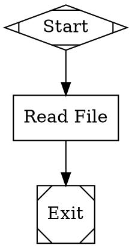
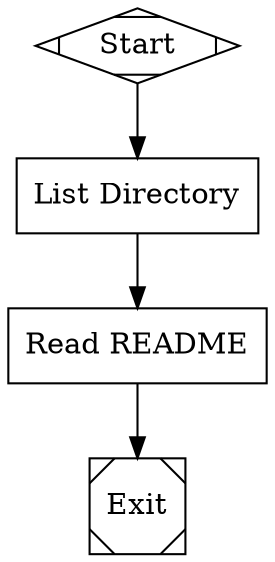
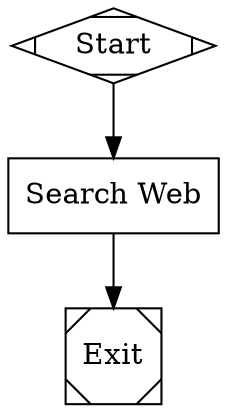

# MCP Integration

MCP (Model Context Protocol) Integration enables Attractor pipelines to invoke external tools via standardized MCP servers. This provides access to file systems, databases, APIs, and other resources through a unified protocol.

## Overview

MCP is a protocol that allows AI models to interact with external tools and resources. Attractor supports MCP through:

1. **MCPClient** - Manages MCP server processes and JSON-RPC communication
2. **MCPHandler** - Pipeline handler for invoking MCP tools from workflows

## Configuration

### MCP Configuration File

Create a `mcp.config.json` file in your project root:

```json
{
  "mcp_servers": {
    "filesystem": {
      "command": "npx",
      "args": ["-y", "@modelcontextprotocol/server-filesystem", "/tmp"],
      "description": "Filesystem access server"
    },
    "brave-search": {
      "command": "npx",
      "args": ["-y", "@modelcontextprotocol/server-brave-search"],
      "env": {
        "BRAVE_API_KEY": "${BRAVE_API_KEY}"
      },
      "description": "Brave web search server"
    }
  }
}
```

### Configuration Fields

- `command` (required): The command to start the MCP server
- `args` (optional): Command-line arguments
- `env` (optional): Environment variables
- `description` (optional): Server description

## Usage

### DOT Workflow Syntax

Use `type="mcp"` to invoke MCP tools:



### Node Attributes

- `mcp_server`: Name of the MCP server (from config)
- `mcp_tool`: Name of the tool to invoke
- `mcp_args`: JSON string of tool arguments
- `timeout`: Optional timeout in milliseconds (default: 30000)

## Example Workflows

### Filesystem Operations



### Web Search



## Logging

MCP handler creates the following log files in the stage directory:

- `mcp_request.json`: Request details (server, tool, arguments)
- `mcp_response.json`: Response from MCP server
- `error.txt`: Error message if tool call fails
- `outcome.json`: Execution outcome

## Error Handling

If an MCP tool call fails, the handler returns `Outcome.fail()` with error details. The pipeline can handle this using conditional edges:

```dot
mcp_call [shape=box label="MCP Call" type="mcp" ...]

mcp_call -> success [condition="outcome=success"]
mcp_call -> fallback [condition="outcome!=success"]
```

## Process Management

- MCP servers are started automatically when first tool is invoked
- Servers remain running for the duration of the pipeline
- All servers are cleaned up when pipeline completes (success or failure)
- Support for up to 10 concurrent MCP servers

## Available MCP Servers

Popular MCP servers you can use:

- `@modelcontextprotocol/server-filesystem` - File system operations
- `@modelcontextprotocol/server-brave-search` - Web search
- `@modelcontextprotocol/server-github` - GitHub operations
- `@modelcontextprotocol/server-postgres` - PostgreSQL database
- `@modelcontextprotocol/server-memory` - Persistent memory

For more servers, check the [MCP repository](https://github.com/modelcontextprotocol).
