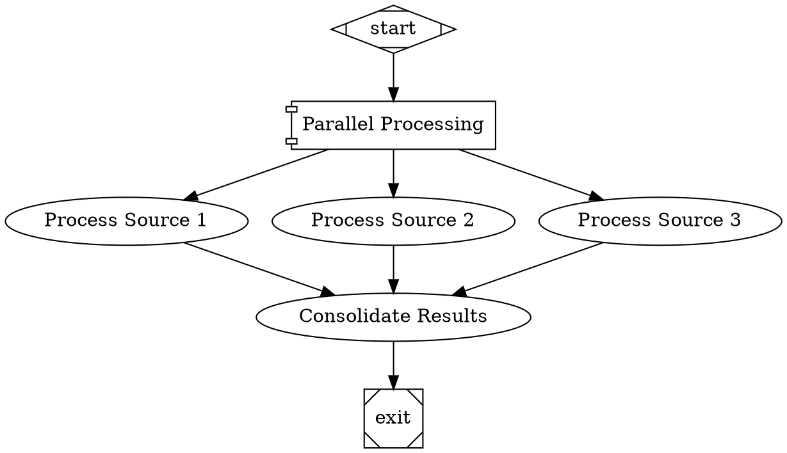

# Parallel Handler

The Parallel Handler executes multiple pipeline branches concurrently, enabling parallel processing of independent tasks. This handler is particularly useful for I/O-bound operations that can benefit from concurrent execution.

## Node Attributes

| Attribute | Type | Required | Description |
|-----------|------|----------|-------------|
| `max_parallel` | number | No | Maximum concurrent branches (default: 4, min: 1, max: 50) |

## Usage Example



## Context Keys

| Key | Type | Description |
|-----|------|-------------|
| `parallel.results` | string (JSON) | Aggregate branch results |
| `parallel.branches.<id>.output` | string | Individual branch output |
| `parallel.success_count` | number | Number of successful branches |
| `parallel.fail_count` | number | Number of failed branches |
| `parallel.total_count` | number | Total branches executed |

## Logging

The Parallel Handler creates a log structure for each execution:

```
logs/
└── <parallel_node_id>/
    ├── summary.json              # Aggregate results
    ├── branch_<branch1_id>/      # Branch 1 logs
    │   ├── prompt.md
    │   ├── response.md
    │   └── outcome.json
    ├── branch_<branch2_id>/      # Branch 2 logs
    │   └── ...
    └── branch_<branch3_id>/      # Branch 3 logs
        └── ...
```

## Result Aggregation

The Parallel Handler aggregates results from all branches and returns an appropriate outcome status:

1. **SUCCESS**: All branches executed successfully
2. **PARTIAL_SUCCESS**: Some branches succeeded, some failed
3. **FAIL**: All branches failed

## Concurrency Control

The handler enforces the `max_parallel` limit to prevent overwhelming system resources. By default, up to 4 branches execute concurrently.

## Error Handling

- **Branch Failures**: Individual branch failures don't affect other branches
- **Exception Handling**: Exceptions are caught and converted to FAIL outcomes
- **Error Isolation**: Branch contexts are isolated to prevent interference

## Implementation Details

The Parallel Handler uses a custom semaphore-based concurrency control mechanism to ensure that no more than `max_parallel` branches execute simultaneously. It creates isolated context snapshots for each branch to ensure they don't interfere with each other.

The handler properly manages the execution lifecycle and aggregates results before returning an outcome to the pipeline engine.