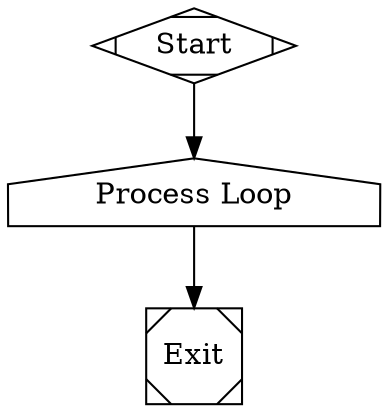

# Stack Manager Loop Handler

The Stack Manager Loop Handler manages recursive execution loops in workflows. It's designed to handle scenarios where a workflow needs to execute a set of operations multiple times until a condition is met.

## Key Features

- **Loop Detection**: Prevents infinite loops by tracking execution iterations
- **Configurable Limits**: Set maximum iterations to prevent runaway execution
- **Context Management**: Maintains proper context isolation across loop iterations
- **Logging**: Comprehensive logging of loop execution details
- **Error Handling**: Graceful handling of loop execution failures

## Usage

This handler is automatically registered with the `house` shape in the DOT syntax:

```dot
loop [shape=house label="Loop Manager" type="stack.manager_loop"]
```

## Configuration

The handler supports the following node attributes:

- `max_iterations` (default: 100): Maximum number of loop iterations
- `condition`: Loop termination condition (if needed)
- `delay`: Delay between iterations (in milliseconds)
- `retry_on_failure` (default: false): Whether to retry on failure

## Example



## Logging

The handler creates the following log files in the stage directory:
- `config.json`: Loop configuration
- `state.json`: Current loop state
- `outcome.json`: Execution outcome