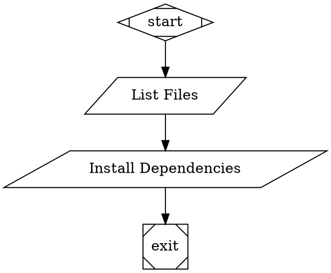

# Tool Handler

The Tool Handler executes external shell commands as part of a pipeline. It's designed to run system commands with proper timeout handling, error management, and logging.

## Node Attributes

| Attribute | Type | Required | Description |
|-----------|------|----------|-------------|
| `tool_command` | string | Yes | Shell command to execute |
| `timeout` | number | No | Timeout in milliseconds (default: 30000) |

## Usage Example

## Context Keys

| Key | Type | Description |
|-----|------|-------------|
| `tool.output` | string | Captured stdout from command execution |

## Logging

The Tool Handler creates a stage directory for each executed command with the following log files:

- `command.txt` - The command that was executed
- `stdout.txt` - Standard output from command (on success)
- `stderr.txt` - Standard error from command (on failure)
- `exit-code.txt` - Exit code from command execution
- `error.txt` - Error information (on execution errors)
- `outcome.json` - JSON representation of the execution outcome

## Error Handling

The Tool Handler handles several types of errors:

1. **Missing `tool_command`**: Returns immediate failure
2. **Command timeout**: Returns failure with timeout message
3. **Non-zero exit code**: Returns failure with exit code and stderr
4. **Execution errors**: Returns failure with error message

## Security Considerations

- **Shell Injection**: This handler does not automatically sanitize command inputs. Users are responsible for validating and sanitizing inputs.
- **Permissions**: Commands run with the same permissions as the Node.js process.
- **Environment**: Commands inherit the full process environment.

## Platform Compatibility

The Tool Handler works on all platforms supported by Node.js:
- Linux
- macOS  
- Windows

Commands are executed using the platform's default shell:
- Unix systems: `/bin/sh` or `/bin/bash`
- Windows: `cmd.exe`

## Implementation Details

The Tool Handler uses Node.js's `child_process.exec` with timeout enforcement and proper error handling. It follows the same logging patterns as other handlers in the system.