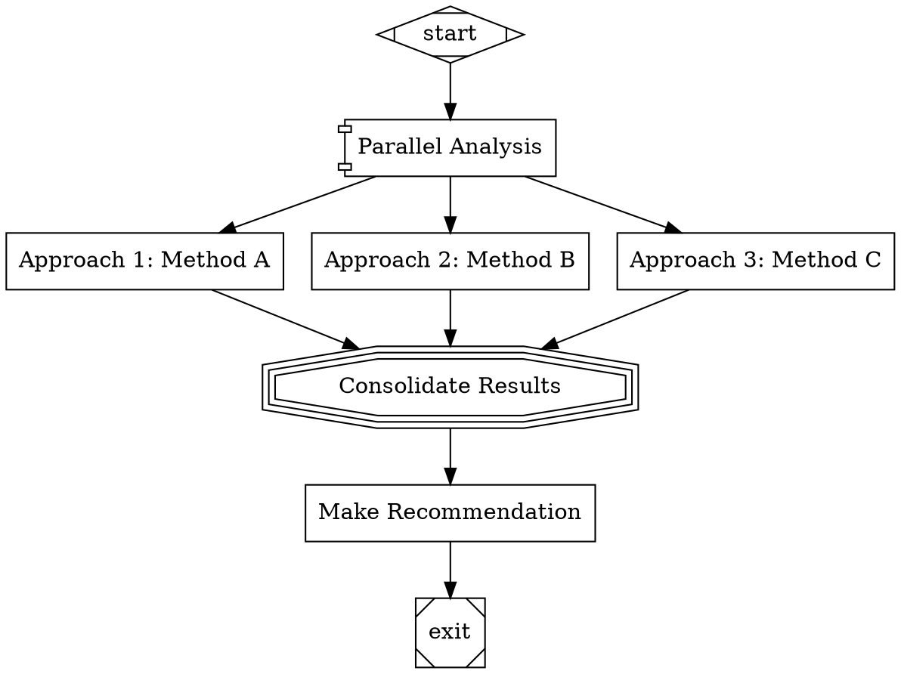

# Requirements: FanIn Handler

## Technical Specifications

### REQ-001: FanInHandler Class Implementation
**From Design**: FR-001  
**Description**: Create a `FanInHandler` class in `src/handlers/fanin.js` that extends the `Handler` base class and implements LLM-based branch consolidation.

**Acceptance Criteria**:
- [ ] Class extends `Handler` from `src/handlers/registry.js`
- [ ] Implements async `execute(node, context, graph, logsRoot)` method
- [ ] Returns `Outcome` object (success or fail)
- [ ] Exports `FanInHandler` class as named export
- [ ] Constructor accepts `backend` parameter (same as CodergenHandler)

---

### REQ-002: Incoming Edge Discovery
**From Design**: FR-001  
**Description**: Discover all incoming edges to the fanin node to identify source branches.

**Acceptance Criteria**:
- [ ] Call `graph.getIncomingEdges(node.id)` to get all incoming edges
- [ ] Extract source node IDs from edges (edge.fromId or edge.from)
- [ ] Preserve edge order for deterministic prompt construction
- [ ] Handle case where no incoming edges exist (see REQ-003)

---

### REQ-003: Empty Incoming Edge Handling
**From Design**: FR-003  
**Description**: Handle degenerate case where fanin node has no incoming edges.

**Acceptance Criteria**:
- [ ] If no incoming edges, return `Outcome.success()` immediately
- [ ] Set notes to "No branches to consolidate"
- [ ] Do not invoke LLM backend
- [ ] Do not write log files

---

### REQ-004: Branch Output Collection
**From Design**: FR-002, FR-004  
**Description**: Collect outputs from all source branches by reading context keys.

**Acceptance Criteria**:
- [ ] For each source node ID, read context key `<source_id>.output`
- [ ] If key exists, add to branch results array with structure: `{ nodeId, output }`
- [ ] If key missing, log warning with `console.warn()` or emit event
- [ ] Continue processing with available outputs (don't fail)
- [ ] Track which branches had outputs vs which were missing

---

### REQ-005: Prompt Base Construction
**From Design**: FR-005, FR-007  
**Description**: Build base consolidation prompt from node attributes with variable expansion.

**Acceptance Criteria**:
- [ ] Read prompt from `node.prompt` attribute
- [ ] Default to "Consolidate the following results:" if no prompt specified
- [ ] Expand variables using CodergenHandler's `_expandVariables()` method or equivalent
- [ ] Support `$goal`, `$last_response`, `$<node_id>.output` patterns
- [ ] Replace `$goal` with `graph.goal` value

---

### REQ-006: Branch Results Formatting
**From Design**: FR-005  
**Description**: Format all collected branch results into structured prompt sections.

**Acceptance Criteria**:
- [ ] Append "\n\n" after base prompt
- [ ] For each branch result (indexed starting at 1):
  - [ ] Add header: `## Result ${index} (from ${nodeId})\n\n`
  - [ ] Add output: `${output}\n\n`
- [ ] Preserve branch order from incoming edges
- [ ] Handle empty outputs gracefully (include placeholder)

---

### REQ-007: Default Consolidation Instruction
**From Design**: FR-006  
**Description**: Append default consolidation instruction if not present in prompt.

**Acceptance Criteria**:
- [ ] Check if prompt contains word "consolidate" (case-insensitive)
- [ ] If not present, append: "\nConsolidate these results into a unified summary."
- [ ] Perform check after all formatting is complete
- [ ] Log whether default instruction was added

---

### REQ-008: Stage Directory Creation
**From Design**: FR-012  
**Description**: Create stage log directory for fanin node.

**Acceptance Criteria**:
- [ ] Create directory at `<logsRoot>/<node.id>`
- [ ] Use `fs.mkdir()` with `{ recursive: true }` option
- [ ] Handle directory creation errors gracefully
- [ ] Return error outcome if directory creation fails

---

### REQ-009: Prompt Logging
**From Design**: FR-012  
**Description**: Write constructed consolidation prompt to log file.

**Acceptance Criteria**:
- [ ] Write prompt to `<stageDir>/prompt.md`
- [ ] Include full prompt with all branch results
- [ ] Use UTF-8 encoding
- [ ] Write before LLM invocation

---

### REQ-010: LLM Backend Invocation
**From Design**: FR-008  
**Description**: Invoke LLM backend to generate consolidated summary.

**Acceptance Criteria**:
- [ ] Check if `this.backend` is configured (not null)
- [ ] Call `backend.run(node, prompt, context)` or similar interface
- [ ] Pass node attributes for model selection/configuration
- [ ] Return response text as string
- [ ] Wrap invocation in try-catch for error handling

---

### REQ-011: Backend Success Handling
**From Design**: FR-009, FR-014  
**Description**: Handle successful LLM backend response.

**Acceptance Criteria**:
- [ ] Write response to `<stageDir>/response.md`
- [ ] Store response in context with key `<node.id>.output`
- [ ] Return `Outcome.success()` with context updates
- [ ] Include notes: "Consolidated X branch results"
- [ ] X should be the count of branches processed

---

### REQ-012: Backend Error Handling
**From Design**: FR-010  
**Description**: Handle LLM backend errors gracefully.

**Acceptance Criteria**:
- [ ] Catch exceptions from backend invocation
- [ ] Return `Outcome.fail()` with failure reason from error message
- [ ] Write error details to `<stageDir>/error.txt`
- [ ] Include stack trace in error log
- [ ] Do not crash handler or propagate exception

---

### REQ-013: Simulation Mode Support
**From Design**: FR-011  
**Description**: Support testing without LLM backend configured.

**Acceptance Criteria**:
- [ ] If `this.backend` is null, enter simulation mode
- [ ] Generate simulated response: `[Simulated consolidation of X results]`
- [ ] Write simulated response to `<stageDir>/response.md`
- [ ] Store in context with key `<node.id>.output`
- [ ] Return `Outcome.success()` with simulation note

---

### REQ-014: Branch Count Tracking
**From Design**: FR-013  
**Description**: Track and report number of branches consolidated.

**Acceptance Criteria**:
- [ ] Count number of branch results collected (not total incoming edges)
- [ ] Include count in outcome notes
- [ ] Store count in context key `fanin.branch_count`
- [ ] Log count to stage directory in metadata file

---

### REQ-015: Handler Registration
**From Design**: Architecture  
**Description**: Register FanInHandler in the handler registry.

**Acceptance Criteria**:
- [ ] Registry already maps `tripleoctagon` shape to `parallel.fan_in` type
- [ ] Engine must instantiate FanInHandler with backend
- [ ] Register with key `parallel.fan_in` in handler registry
- [ ] Verify `registry.has('parallel.fan_in')` returns true after initialization

---

### REQ-016: Variable Expansion Utility (Optional)
**From Design**: FR-007  
**Description**: Extract or reuse variable expansion logic from CodergenHandler.

**Acceptance Criteria**:
- [ ] OPTION A: Extract `_expandVariables()` to shared utility module
- [ ] OPTION B: Copy method to FanInHandler (code duplication)
- [ ] OPTION C: Import and call CodergenHandler's private method
- [ ] Support same variable patterns: `$goal`, `$last_response`, `$<node>.output`
- [ ] Preserve case sensitivity and escaping behavior

---

### REQ-017: Outcome Status File Logging
**From Design**: FR-012  
**Description**: Write outcome status to log file for persistence.

**Acceptance Criteria**:
- [ ] Write outcome to `<stageDir>/outcome.json`
- [ ] Include fields: status, notes, failureReason (if any)
- [ ] Include timestamp and branch count
- [ ] Write after LLM response received

---

## Interface Contracts

### FanInHandler Class Interface

```javascript
import { Handler } from './registry.js';
import { Outcome } from '../pipeline/outcome.js';

export class FanInHandler extends Handler {
  /**
   * @param {Object} backend - LLM backend for consolidation (same as CodergenHandler)
   */
  constructor(backend = null);

  /**
   * Consolidate results from multiple branches using LLM
   * @param {Object} node - FanIn node with prompt attribute
   * @param {Context} context - Execution context with branch outputs
   * @param {Graph} graph - Pipeline graph
   * @param {string} logsRoot - Root directory for logs
   * @returns {Promise<Outcome>} Consolidation outcome
   */
  async execute(node, context, graph, logsRoot): Promise<Outcome>;

  /**
   * Expand variables in prompt (same as CodergenHandler)
   * @private
   */
  _expandVariables(prompt, graph, context): string;
}
```

### Node Attributes Schema

```javascript
{
  "id": "string",              // Node identifier
  "shape": "tripleoctagon",    // Must be tripleoctagon for fanin handler
  "label": "string",           // Display name (optional)
  "prompt": "string",          // Consolidation prompt (optional)
  "attributes": {
    // Same attributes as CodergenHandler for model selection
    "model": "string",         // Optional: Override model
    "temperature": "number",   // Optional: LLM temperature
    "max_tokens": "number"     // Optional: Max response tokens
  }
}
```

### Context Keys

#### Input Keys (from branches)
| Key | Type | Description | Source |
|-----|------|-------------|--------|
| `<source_node_id>.output` | string | Output from source branch | Branch execution |

#### Output Keys (set by fanin)
| Key | Type | Description |
|-----|------|-------------|
| `<fanin_node_id>.output` | string | Consolidated result |
| `fanin.branch_count` | number | Number of branches consolidated |
| `last_response` | string | Consolidated result (standard key) |

### Log Files

| File | Content | When Written |
|------|---------|--------------|
| `prompt.md` | Full consolidation prompt | Before LLM call |
| `response.md` | LLM consolidated response | After LLM call |
| `outcome.json` | Outcome status and metadata | After execution |
| `error.txt` | Exception details | On error only |

### Outcome Response Schema

**Success (with LLM)**:
```javascript
{
  status: 'SUCCESS',
  notes: 'Consolidated 3 branch results',
  contextUpdates: {
    '<node_id>.output': '<consolidated response>',
    'fanin.branch_count': 3,
    'last_response': '<consolidated response>'
  }
}
```

**Success (simulation mode)**:
```javascript
{
  status: 'SUCCESS',
  notes: 'Simulated consolidation of 3 results',
  contextUpdates: {
    '<node_id>.output': '[Simulated consolidation of 3 results]',
    'fanin.branch_count': 3
  }
}
```

**Success (no branches)**:
```javascript
{
  status: 'SUCCESS',
  notes: 'No branches to consolidate',
  contextUpdates: {}
}
```

**Failure (backend error)**:
```javascript
{
  status: 'FAIL',
  failureReason: 'Backend error: <error message>',
  notes: null,
  contextUpdates: {}
}
```

---

## Constraints

### Performance
- **Prompt Construction**: Must complete within 20ms (excluding context reads)
- **LLM Latency**: Depends on backend (typically 1-5 seconds for consolidation)
- **Memory**: Prompt size should not exceed 500KB total

### Prompt Size Limits
- **Branch Count**: Support up to 50 incoming branches
- **Output Size**: Each branch output up to 10KB
- **Total Prompt**: Maximum 500KB (warn if approached)

### LLM Context Windows
- **Model Limits**: Must respect model-specific context windows
- **Overflow Handling**: Fail gracefully if prompt exceeds limit
- **Warning Threshold**: Log warning if prompt > 80% of context window

### Error Handling
- **Missing Outputs**: Continue with available branches, log warning
- **Backend Failures**: Capture error, don't crash handler
- **Empty Branches**: Handle gracefully (no outputs available)

### Compatibility
- **Backend Interface**: Must match CodergenHandler backend interface
- **Node.js Version**: Requires Node.js 14+ (same as project)
- **Variable Syntax**: Must support same patterns as CodergenHandler

---

## Traceability Matrix

| Requirement | Design Source | Test Case(s) |
|-------------|---------------|--------------|
| REQ-001 | FR-001 | TC-001 |
| REQ-002 | FR-001 | TC-002, TC-003 |
| REQ-003 | FR-003 | TC-003 |
| REQ-004 | FR-002, FR-004 | TC-004, TC-005 |
| REQ-005 | FR-005, FR-007 | TC-006 |
| REQ-006 | FR-005 | TC-007 |
| REQ-007 | FR-006 | TC-008 |
| REQ-008 | FR-012 | TC-009 |
| REQ-009 | FR-012 | TC-009 |
| REQ-010 | FR-008 | TC-010, TC-011 |
| REQ-011 | FR-009, FR-014 | TC-010 |
| REQ-012 | FR-010 | TC-011 |
| REQ-013 | FR-011 | TC-012 |
| REQ-014 | FR-013 | TC-010, TC-012 |
| REQ-015 | Architecture | TC-013 |
| REQ-016 | FR-007 | TC-014 |
| REQ-017 | FR-012 | TC-009 |

---

## Example DOT Usage



---

## Consolidation Prompt Example

Given the DOT above and branch outputs:

**Input**:
- `approach1.output`: "Method A provides fast execution..."
- `approach2.output`: "Method B offers better accuracy..."
- `approach3.output`: "Method C balances speed and accuracy..."

**Generated Prompt**:
```markdown
Compare and synthesize the following approaches to: Compare multiple approaches to solving a problem

## Result 1 (from approach1)

Method A provides fast execution...

## Result 2 (from approach2)

Method B offers better accuracy...

## Result 3 (from approach3)

Method C balances speed and accuracy...
```

**LLM Response** (stored in `consolidate.output`):
```
After analyzing all three approaches:
- Method A excels in speed but sacrifices accuracy
- Method B provides highest accuracy at performance cost
- Method C offers optimal balance for most use cases

Recommendation: Method C for general purpose, Method A for time-critical operations.
```

---

## Backend Interface Requirements

The FanInHandler must be compatible with the same backend interface as CodergenHandler:

```javascript
interface Backend {
  /**
   * Execute LLM completion
   * @param {Object} node - Node with attributes for model selection
   * @param {string} prompt - Prompt to send to LLM
   * @param {Context} context - Pipeline context
   * @param {string} selectedModel - Optional pre-selected model
   * @returns {Promise<string>} - LLM response text
   */
  async run(node, prompt, context, selectedModel?): Promise<string>;
}
```

If backend returns an `Outcome` object instead of string, handle both cases:
```javascript
const result = await backend.run(node, prompt, context);
const responseText = (typeof result === 'string') ? result : result.response;
```

---

## Missing Output Warning Format

When branch outputs are missing, log warnings:

```javascript
console.warn(`FanIn [${node.id}]: Branch output missing for node '${sourceNodeId}'`);
// Or emit event:
this.emit('fanin_branch_missing', { 
  faninNodeId: node.id, 
  missingBranchId: sourceNodeId 
});
```

Include in outcome notes if any branches missing:
```javascript
notes: 'Consolidated 2 branch results (1 branch output missing)'
```
