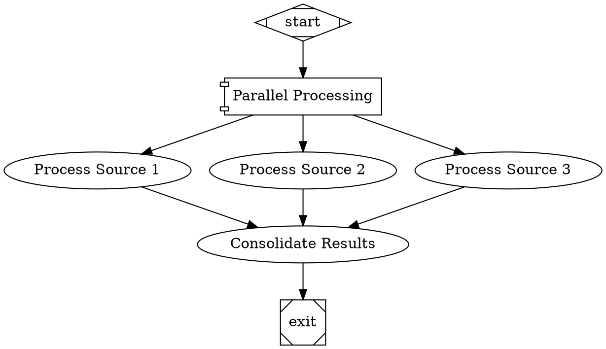

# Requirements: Parallel Handler

## Technical Specifications

### REQ-001: ParallelHandler Class Implementation
**From Design**: FR-001  
**Description**: Create a `ParallelHandler` class in `src/handlers/parallel.js` that extends the `Handler` base class and implements concurrent branch execution.

**Acceptance Criteria**:
- [ ] Class extends `Handler` from `src/handlers/registry.js`
- [ ] Implements async `execute(node, context, graph, logsRoot)` method
- [ ] Returns `Outcome` object with status SUCCESS, PARTIAL_SUCCESS, or FAIL
- [ ] Exports `ParallelHandler` class as named export
- [ ] Uses async/await pattern (not worker threads)

---

### REQ-002: Outgoing Edge Discovery
**From Design**: FR-001, FR-009  
**Description**: Discover all outgoing edges from the parallel node to determine which branches to execute.

**Acceptance Criteria**:
- [ ] Call `graph.getOutgoingEdges(node.id)` to get all edges
- [ ] If no edges found, return `Outcome.success()` immediately
- [ ] Extract target node IDs from edges
- [ ] Preserve edge order for deterministic execution

---

### REQ-003: Max Parallel Configuration
**From Design**: FR-004  
**Description**: Support configurable concurrency limit with sensible default.

**Acceptance Criteria**:
- [ ] Read `max_parallel` from `node.attributes.max_parallel`
- [ ] Default to 4 if not specified
- [ ] Parse as integer using `parseInt()`
- [ ] Validate min value of 1, max value of 50
- [ ] Log warning if value exceeds 50 (use 50)

---

### REQ-004: Context Snapshot Creation
**From Design**: FR-002  
**Description**: Create isolated context snapshots for each branch to prevent interference.

**Acceptance Criteria**:
- [ ] Call `context.snapshot()` for each branch before execution
- [ ] Create new `Context` instance for each branch
- [ ] Populate new context with snapshot data using `context.values.set()`
- [ ] Verify branches cannot modify parent context during execution
- [ ] Preserve context logs separately for each branch

---

### REQ-005: Concurrent Branch Execution
**From Design**: FR-003, FR-004  
**Description**: Execute branches concurrently using `Promise.allSettled()` with concurrency control.

**Acceptance Criteria**:
- [ ] Use `Promise.allSettled()` to execute all branches
- [ ] Implement concurrency limiter (e.g., p-limit library or custom semaphore)
- [ ] Ensure max `max_parallel` branches execute simultaneously
- [ ] Wait for all branches to complete (no early termination)
- [ ] Capture outcome from each branch execution

---

### REQ-006: Branch Execution Logic
**From Design**: FR-001  
**Description**: Execute a single branch node using the appropriate handler from the registry.

**Acceptance Criteria**:
- [ ] Get target node from graph using edge.toId
- [ ] Resolve handler for target node using `handlerRegistry.resolve(targetNode)`
- [ ] Call `handler.execute(targetNode, branchContext, graph, branchLogsRoot)`
- [ ] Return outcome from handler
- [ ] Handle case where handler is not found (return FAIL outcome)

---

### REQ-007: Branch Exception Handling
**From Design**: FR-008  
**Description**: Catch and handle exceptions from individual branch executions without canceling others.

**Acceptance Criteria**:
- [ ] Wrap each branch execution in try-catch
- [ ] On exception, create `Outcome.fail()` with exception message
- [ ] Include stack trace in failure reason
- [ ] Log exception to branch log directory
- [ ] Do NOT propagate exception to parallel handler level
- [ ] Other branches continue executing

---

### REQ-008: Result Aggregation - Full Success
**From Design**: FR-005  
**Description**: Detect when all branches succeed and return aggregate success outcome.

**Acceptance Criteria**:
- [ ] Count branches with `outcome.status === StageStatus.SUCCESS`
- [ ] If success count equals total branch count, return success
- [ ] Aggregate outcome status is `StageStatus.SUCCESS`
- [ ] Include success count in notes: "All X branches succeeded"
- [ ] Store results in context (see REQ-011)

---

### REQ-009: Result Aggregation - Partial Success
**From Design**: FR-006  
**Description**: Detect when some but not all branches succeed and return partial success outcome.

**Acceptance Criteria**:
- [ ] If success count > 0 but < total, return partial success
- [ ] Aggregate outcome status is `StageStatus.PARTIAL_SUCCESS`
- [ ] Include counts in notes: "X/Y branches succeeded"
- [ ] List failed branch IDs in failure reason
- [ ] Store all branch results in context (see REQ-011)

---

### REQ-010: Result Aggregation - Complete Failure
**From Design**: FR-007  
**Description**: Detect when all branches fail and return aggregate failure outcome.

**Acceptance Criteria**:
- [ ] If success count is 0, return failure
- [ ] Aggregate outcome status is `StageStatus.FAIL`
- [ ] Include failure reason: "All X branches failed"
- [ ] List all branch failure reasons in aggregated failure reason
- [ ] Store results in context (see REQ-011)

---

### REQ-011: Context Result Storage
**From Design**: FR-010  
**Description**: Store aggregated branch results in context for downstream nodes.

**Acceptance Criteria**:
- [ ] Store results in context key `parallel.results` as JSON string
- [ ] JSON structure: `{ branches: [{ id, status, notes, failureReason }] }`
- [ ] For each branch, include: node ID, status, notes, failure reason (if any)
- [ ] Store individual branch outputs in `parallel.branches.<branch_id>.output`
- [ ] Update main context with these keys before returning

---

### REQ-012: Branch Log Directory Creation
**From Design**: FR-011  
**Description**: Create separate log directories for each branch under parallel node's directory.

**Acceptance Criteria**:
- [ ] Create parallel node directory: `<logsRoot>/<parallel_node_id>`
- [ ] For each branch, create: `<logsRoot>/<parallel_node_id>/branch_<branch_node_id>`
- [ ] Pass branch log directory to branch handler execution
- [ ] Use `fs.mkdir()` with `{ recursive: true }`
- [ ] Write parallel handler summary to `<logsRoot>/<parallel_node_id>/summary.json`

---

### REQ-013: PARTIAL_SUCCESS Status Addition
**From Design**: FR-006, Dependencies  
**Description**: Add `PARTIAL_SUCCESS` status to the StageStatus enum.

**Acceptance Criteria**:
- [ ] Add `PARTIAL_SUCCESS: 'PARTIAL_SUCCESS'` to `StageStatus` enum in `src/pipeline/outcome.js`
- [ ] Ensure `Outcome` class supports this status
- [ ] Update outcome status type definitions if using TypeScript
- [ ] Document in JSDoc comments

---

### REQ-014: Handler Registration
**From Design**: Architecture  
**Description**: Register ParallelHandler in the handler registry during engine initialization.

**Acceptance Criteria**:
- [ ] Registry already maps `component` shape to `parallel` type (verify)
- [ ] Engine must instantiate ParallelHandler
- [ ] Register with key `parallel` in handler registry
- [ ] Pass handler registry to ParallelHandler constructor (for branch execution)
- [ ] Verify `registry.has('parallel')` returns true after initialization

---

### REQ-015: Concurrency Limiter Implementation
**From Design**: FR-004  
**Description**: Implement or integrate concurrency control to respect `max_parallel` limit.

**Acceptance Criteria**:
- [ ] OPTION A: Use `p-limit` npm package for concurrency control
- [ ] OPTION B: Implement custom semaphore pattern with Promise queue
- [ ] Ensure no more than `max_parallel` branches execute simultaneously
- [ ] Measure: At any point in time, active branch count ≤ `max_parallel`
- [ ] Queue remaining branches until slot available

---

### REQ-016: Event Emission for Observability
**From Design**: NFR-005  
**Description**: Emit events for parallel execution lifecycle to enable monitoring.

**Acceptance Criteria**:
- [ ] Emit `parallel_start` event with node ID and branch count
- [ ] Emit `parallel_branch_start` for each branch with branch ID
- [ ] Emit `parallel_branch_complete` for each branch with outcome
- [ ] Emit `parallel_complete` with aggregate results
- [ ] Events should include timestamp and relevant context
- [ ] Use EventEmitter pattern if engine extends EventEmitter

---

### REQ-017: Summary Logging
**From Design**: FR-011  
**Description**: Write aggregate summary of parallel execution to log files.

**Acceptance Criteria**:
- [ ] Write summary to `<parallel_node_dir>/summary.json`
- [ ] Include: total branches, success count, fail count, partial success status
- [ ] Include list of all branch IDs and their statuses
- [ ] Include execution timestamps (start, end, duration)
- [ ] Include `max_parallel` value used

---

## Interface Contracts

### ParallelHandler Class Interface

```javascript
import { Handler } from './registry.js';
import { Outcome } from '../pipeline/outcome.js';

export class ParallelHandler extends Handler {
  /**
   * @param {HandlerRegistry} handlerRegistry - Registry for resolving branch handlers
   */
  constructor(handlerRegistry);

  /**
   * Execute multiple branches in parallel
   * @param {Object} node - Parallel node with max_parallel attribute
   * @param {Context} context - Execution context
   * @param {Graph} graph - Pipeline graph
   * @param {string} logsRoot - Root directory for logs
   * @returns {Promise<Outcome>} Aggregate execution outcome
   */
  async execute(node, context, graph, logsRoot): Promise<Outcome>;

  /**
   * Execute a single branch
   * @private
   */
  async _executeBranch(branchNode, branchContext, graph, branchLogsRoot): Promise<Outcome>;
}
```

### Node Attributes Schema

```javascript
{
  "id": "string",           // Node identifier
  "shape": "component",     // Must be component for parallel handler
  "label": "string",        // Display name (optional)
  "attributes": {
    "max_parallel": "number"  // OPTIONAL: Max concurrent branches (default: 4)
  }
}
```

### Context Keys

| Key | Type | Description | Example |
|-----|------|-------------|---------|
| `parallel.results` | string (JSON) | Aggregate branch results | `{"branches": [...]}` |
| `parallel.branches.<id>.output` | string | Individual branch output | Output from branch node |
| `parallel.success_count` | number | Number of successful branches | 3 |
| `parallel.fail_count` | number | Number of failed branches | 1 |
| `parallel.total_count` | number | Total branches executed | 4 |

### Log Directory Structure

```
logs/
└── <parallel_node_id>/
    ├── summary.json              # Aggregate results
    ├── branch_<branch1_id>/      # Branch 1 logs
    │   ├── prompt.md
    │   ├── response.md
    │   └── outcome.json
    ├── branch_<branch2_id>/      # Branch 2 logs
    │   └── ...
    └── branch_<branch3_id>/      # Branch 3 logs
        └── ...
```

### Outcome Response Schema

**Full Success**:
```javascript
{
  status: 'SUCCESS',
  notes: 'All 3 branches succeeded',
  contextUpdates: {
    'parallel.results': '{"branches": [...]}',
    'parallel.success_count': 3,
    'parallel.fail_count': 0,
    'parallel.total_count': 3
  }
}
```

**Partial Success**:
```javascript
{
  status: 'PARTIAL_SUCCESS',
  notes: '2/3 branches succeeded',
  failureReason: 'Failed branches: branch2 (reason)',
  contextUpdates: {
    'parallel.results': '{"branches": [...]}',
    'parallel.success_count': 2,
    'parallel.fail_count': 1,
    'parallel.total_count': 3
  }
}
```

**Complete Failure**:
```javascript
{
  status: 'FAIL',
  failureReason: 'All 3 branches failed: [reasons...]',
  notes: 'All 3 branches failed',
  contextUpdates: {
    'parallel.results': '{"branches": [...]}',
    'parallel.success_count': 0,
    'parallel.fail_count': 3,
    'parallel.total_count': 3
  }
}
```

**Empty Branches (No Work)**:
```javascript
{
  status: 'SUCCESS',
  notes: 'No branches to execute',
  contextUpdates: {}
}
```

---

## Constraints

### Performance
- **Handler Overhead**: Parallel handler setup must complete within 50ms
- **Speedup**: For N branches with max_parallel=M, time ≈ max_branch_time × ceil(N/M)
- **Event Loop**: Must not block Node.js event loop during branch scheduling

### Memory Management
- **Context Snapshots**: Each branch gets independent context (no shared references)
- **Memory Limit**: Total memory for N branches ≈ N × base_context_size
- **Garbage Collection**: Branch contexts released after aggregation

### Concurrency
- **Max Branches**: Must support up to 100 branches
- **Max Parallelism**: `max_parallel` values from 1 to 50 supported
- **Semaphore**: Must enforce concurrency limit accurately

### Reliability
- **Error Isolation**: One branch crash must not affect others
- **Completion Guarantee**: Must wait for all branches (no early exit)
- **Timeout Handling**: Individual branch timeouts handled by branch nodes

### Compatibility
- **Node.js Version**: Requires Node.js 14+ for modern Promise APIs
- **Async Support**: All handlers must support async/await pattern

---

## Traceability Matrix

| Requirement | Design Source | Test Case(s) |
|-------------|---------------|--------------|
| REQ-001 | FR-001 | TC-001, TC-002 |
| REQ-002 | FR-001, FR-009 | TC-003 |
| REQ-003 | FR-004 | TC-004, TC-005 |
| REQ-004 | FR-002 | TC-006 |
| REQ-005 | FR-003, FR-004 | TC-007, TC-008 |
| REQ-006 | FR-001 | TC-002 |
| REQ-007 | FR-008 | TC-009 |
| REQ-008 | FR-005 | TC-010 |
| REQ-009 | FR-006 | TC-011 |
| REQ-010 | FR-007 | TC-012 |
| REQ-011 | FR-010 | TC-013 |
| REQ-012 | FR-011 | TC-014 |
| REQ-013 | FR-006 | TC-011 |
| REQ-014 | Architecture | TC-015 |
| REQ-015 | FR-004 | TC-008 |
| REQ-016 | NFR-005 | TC-016 |
| REQ-017 | FR-011 | TC-014 |

---

## Dependencies

### NPM Packages (Optional)
- `p-limit` - Concurrency control (alternative to custom implementation)
  - Install: `npm install p-limit`
  - Usage: `const pLimit = require('p-limit'); const limit = pLimit(4);`

### Internal Updates
- `src/pipeline/outcome.js` - Add `PARTIAL_SUCCESS` to `StageStatus` enum
- `src/pipeline/context.js` - Verify `snapshot()` method works correctly

---

## Example DOT Usage



---

## Concurrency Control Implementation Examples

### Option A: Using p-limit

```javascript
import pLimit from 'p-limit';

async execute(node, context, graph, logsRoot) {
  const maxParallel = parseInt(node.attributes?.max_parallel || 4);
  const limit = pLimit(maxParallel);
  const edges = graph.getOutgoingEdges(node.id);
  
  const promises = edges.map(edge => 
    limit(() => this._executeBranch(edge, context, graph, logsRoot))
  );
  
  const results = await Promise.allSettled(promises);
  return this._aggregateResults(results);
}
```

### Option B: Custom Semaphore

```javascript
class Semaphore {
  constructor(max) {
    this.max = max;
    this.current = 0;
    this.queue = [];
  }
  
  async acquire() {
    while (this.current >= this.max) {
      await new Promise(resolve => this.queue.push(resolve));
    }
    this.current++;
  }
  
  release() {
    this.current--;
    const resolve = this.queue.shift();
    if (resolve) resolve();
  }
}
```
