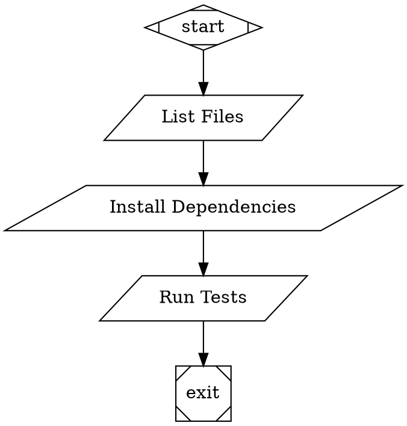

# Requirements: Tool Handler

## Technical Specifications

### REQ-001: ToolHandler Class Implementation
**From Design**: FR-001  
**Description**: Create a `ToolHandler` class in `src/handlers/tool.js` that extends the `Handler` base class and implements the `execute()` method to run shell commands.

**Acceptance Criteria**:
- [ ] Class extends `Handler` from `src/handlers/registry.js`
- [ ] Implements async `execute(node, context, graph, logsRoot)` method
- [ ] Returns `Outcome` object (success or fail)
- [ ] Uses `child_process.exec` from Node.js for command execution
- [ ] Exports `ToolHandler` class as named export

---

### REQ-002: Command Attribute Extraction
**From Design**: FR-001, FR-007  
**Description**: Extract and validate the `tool_command` attribute from the node. Fail immediately if missing.

**Acceptance Criteria**:
- [ ] Read `tool_command` from `node.attributes.tool_command` or `node.attrs.tool_command`
- [ ] If undefined, empty string, or null, return `Outcome.fail("No tool_command specified")`
- [ ] No command execution attempted when validation fails
- [ ] Log validation failure to stage directory

---

### REQ-003: Timeout Configuration
**From Design**: FR-002  
**Description**: Support configurable command timeout with sensible default.

**Acceptance Criteria**:
- [ ] Read `timeout` from `node.attributes.timeout` or `node.attrs.timeout`
- [ ] Default to 30000ms (30 seconds) if not specified
- [ ] Parse timeout as integer (use `parseInt()`)
- [ ] Pass timeout to `child_process.exec` options

---

### REQ-004: Command Execution with Timeout
**From Design**: FR-002, FR-006  
**Description**: Execute command with timeout enforcement using promisified exec.

**Acceptance Criteria**:
- [ ] Use `util.promisify(child_process.exec)` for promise-based execution
- [ ] Pass command string as first argument
- [ ] Pass options object with `{ timeout: <ms>, maxBuffer: 1024 * 1024 }`
- [ ] Handle timeout errors separately from command errors
- [ ] On timeout, return `Outcome.fail(\`Command timed out after ${timeout}ms\`)`

---

### REQ-005: Success Path - Exit Code 0
**From Design**: FR-004  
**Description**: When command succeeds (exit code 0), capture output and return success outcome.

**Acceptance Criteria**:
- [ ] Detect success when `child_process.exec` resolves without error
- [ ] Capture stdout from execution result
- [ ] Store stdout in context with key `tool.output`
- [ ] Return `Outcome.success()` with context updates
- [ ] Include notes field: `"Tool completed: <command>"`
- [ ] Write stdout to `<stageDir>/stdout.txt`

---

### REQ-006: Failure Path - Non-Zero Exit Code
**From Design**: FR-005  
**Description**: When command fails (non-zero exit code), capture error details and return failure outcome.

**Acceptance Criteria**:
- [ ] Detect failure when `child_process.exec` rejects with error
- [ ] Capture exit code from `error.code` or parse from `error.message`
- [ ] Capture stderr from error object
- [ ] Return `Outcome.fail(\`Exit code ${exitCode}: ${stderr}\`)`
- [ ] Write stderr to `<stageDir>/stderr.txt`
- [ ] Do NOT update context with tool.output on failure

---

### REQ-007: Stage Directory and Logging
**From Design**: FR-008  
**Description**: Create stage log directory and write execution artifacts.

**Acceptance Criteria**:
- [ ] Create directory at `<logsRoot>/<node.id>` using `fs.mkdir()`
- [ ] Use `{ recursive: true }` option to create parent directories
- [ ] Write command text to `<stageDir>/command.txt` before execution
- [ ] Write stdout to `<stageDir>/stdout.txt` after success
- [ ] Write stderr to `<stageDir>/stderr.txt` after failure
- [ ] Write exit code to `<stageDir>/exit-code.txt` in all cases
- [ ] Write outcome status to `<stageDir>/outcome.json`

---

### REQ-008: Error Handling - Execution Errors
**From Design**: FR-006  
**Description**: Handle unexpected execution errors gracefully.

**Acceptance Criteria**:
- [ ] Wrap execution in try-catch block
- [ ] Catch `Error` instances from exec
- [ ] Distinguish timeout errors (error.killed === true or error.code === 'ETIMEDOUT')
- [ ] For timeout: Return `Outcome.fail("Command timed out after Xms")`
- [ ] For other errors: Return `Outcome.fail(\`Execution error: ${error.message}\`)`
- [ ] Log all errors to `<stageDir>/error.txt`

---

### REQ-009: Handler Registration
**From Design**: Architecture  
**Description**: Register ToolHandler in the handler registry during engine initialization.

**Acceptance Criteria**:
- [ ] Registry already maps `parallelogram` shape to `tool` type (no changes needed)
- [ ] Engine must instantiate and register ToolHandler with key `tool`
- [ ] Registration happens in `src/pipeline/engine.js` or main entry point
- [ ] Verify registration by checking `registry.has('tool')` returns true

---

### REQ-010: Variable Expansion (Optional)
**From Design**: FR-009  
**Description**: Support context variable substitution in commands using existing expansion logic.

**Acceptance Criteria**:
- [ ] OPTIONAL: If CodergenHandler has `_expandVariables()` method, extract to shared utility
- [ ] Apply variable expansion to `tool_command` before execution
- [ ] Support `$last_response`, `$goal`, `$<node_id>.output` patterns
- [ ] If not implemented in MVP, document as future enhancement
- [ ] No expansion errors should crash handler (fail gracefully)

---

## Interface Contracts

### ToolHandler Class Interface

```javascript
import { Handler } from './registry.js';
import { Outcome } from '../pipeline/outcome.js';

export class ToolHandler extends Handler {
  /**
   * Execute external shell command
   * @param {Object} node - Pipeline node with tool_command attribute
   * @param {Context} context - Execution context
   * @param {Graph} graph - Pipeline graph
   * @param {string} logsRoot - Root directory for logs
   * @returns {Promise<Outcome>} Execution outcome
   */
  async execute(node, context, graph, logsRoot): Promise<Outcome>
}
```

### Node Attributes Schema

```javascript
{
  "id": "string",           // Node identifier
  "shape": "parallelogram", // Must be parallelogram for tool handler
  "label": "string",        // Display name (optional)
  "attributes": {
    "tool_command": "string",  // REQUIRED: Shell command to execute
    "timeout": "number"        // OPTIONAL: Timeout in ms (default: 30000)
  }
}
```

### Context Keys

| Key | Type | Description | Set On |
|-----|------|-------------|--------|
| `tool.output` | string | Captured stdout | Success only |

### Log Files

| File | Content | When Written |
|------|---------|--------------|
| `command.txt` | Command string | Before execution |
| `stdout.txt` | Standard output | After success |
| `stderr.txt` | Standard error | After failure |
| `exit-code.txt` | Numeric exit code | Always |
| `error.txt` | Exception details | On exception |
| `outcome.json` | Outcome object | Always |

### Outcome Response Schema

**Success**:
```javascript
{
  status: 'SUCCESS',
  notes: 'Tool completed: <command>',
  contextUpdates: {
    'tool.output': '<stdout content>'
  }
}
```

**Failure (Non-Zero Exit)**:
```javascript
{
  status: 'FAIL',
  failureReason: 'Exit code 1: <stderr content>',
  notes: null,
  contextUpdates: {}
}
```

**Failure (Timeout)**:
```javascript
{
  status: 'FAIL',
  failureReason: 'Command timed out after 30000ms',
  notes: null,
  contextUpdates: {}
}
```

**Failure (Missing Command)**:
```javascript
{
  status: 'FAIL',
  failureReason: 'No tool_command specified',
  notes: null,
  contextUpdates: {}
}
```

---

## Constraints

### Performance
- **Command Start Latency**: Must invoke exec within 10ms of handler call
- **Output Buffer Size**: Maximum 1MB of combined stdout/stderr (`maxBuffer: 1024 * 1024`)
- **Timeout Enforcement**: Must terminate process within 100ms of timeout expiration

### Security
- **Shell Injection**: No automatic sanitization - users responsible for input validation
- **Command Validation**: Only validate presence, not content
- **Path Access**: Commands run with same permissions as Node.js process
- **Environment**: Inherits process.env from parent (no isolation)

### Compatibility
- **Node.js Version**: Requires Node.js 14+ for `fs/promises` support
- **Platform Support**: Must work on Linux, macOS, Windows
- **Shell Detection**: Uses platform default shell (sh/bash on Unix, cmd.exe on Windows)

### Error Handling
- **No Retries**: Commands are not retried on failure (single execution)
- **No Partial Success**: Either success (exit 0) or fail (non-zero)
- **Stderr on Success**: Stderr output is ignored if exit code is 0

---

## Traceability Matrix

| Requirement | Design Source | Test Case(s) |
|-------------|---------------|--------------|
| REQ-001 | FR-001 | TC-001, TC-002 |
| REQ-002 | FR-007 | TC-003 |
| REQ-003 | FR-002 | TC-004, TC-005 |
| REQ-004 | FR-002, FR-006 | TC-005, TC-006 |
| REQ-005 | FR-004 | TC-001, TC-002 |
| REQ-006 | FR-005 | TC-007, TC-008 |
| REQ-007 | FR-008 | TC-009 |
| REQ-008 | FR-006 | TC-005, TC-006 |
| REQ-009 | Architecture | TC-010 |
| REQ-010 | FR-009 | TC-011 (optional) |

---

## Example DOT Usage


