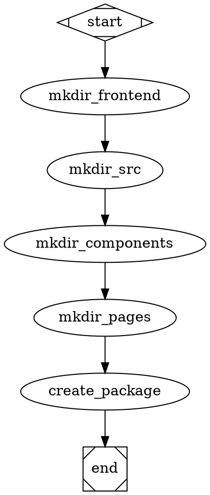
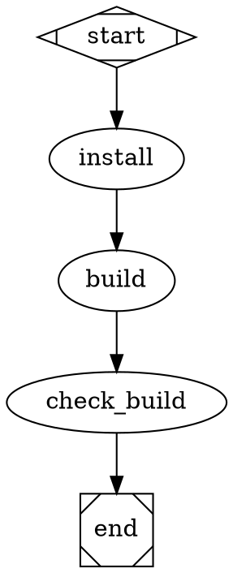
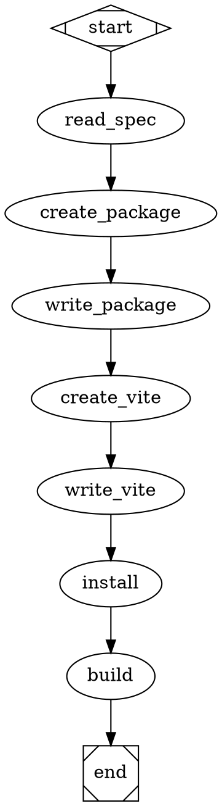

# Spec: Filesystem Handler

## Overview

A new handler for Attractor that enables reading/writing files and executing shell commands. This allows workflows to build projects, run tests, and perform file operations.

## Problem Statement

Currently, Attractor workflows can execute JavaScript code via the CodergenHandler, but cannot:
- Read/write local files
- Execute shell commands
- Run build tools (npm, docker, etc.)
- Manipulate project structure

This limits workflows to pure computation without side effects.

## Use Cases

1. **Self-building workflows** - Generate and write code files
2. **Project scaffolding** - Create directory structures
3. **Build automation** - Run npm build, docker build, etc.
4. **Testing** - Run test suites and capture results
5. **Deployment** - Execute deployment scripts

## Handler Design

### Handler Type: `filesystem`

### Attributes

| Attribute | Type | Required | Description |
|-----------|------|----------|-------------|
| operation | string | Yes | Operation: `read`, `write`, `mkdir`, `delete`, `shell`, `copy`, `exists` |
| path | string | Yes | File or directory path |
| content | string | No | Content for write operations |
| mode | string | No | File permissions (e.g., "755") |
| recursive | boolean | No | For mkdir/delete operations |
| timeout | number | No | Timeout in ms (default: 30000) |

### Operations

#### 1. Read File
```
node [handler="filesystem", operation="read", path="specs/frontend-ui/tasks.md"]
```
Returns: File contents as string

#### 2. Write File
```
node [handler="filesystem", operation="write", path="frontend/src/App.jsx", content="..."]
```
Returns: Success/failure

#### 3. Create Directory
```
node [handler="filesystem", operation="mkdir", path="frontend/src/components", recursive=true]
```
Returns: Success/failure

#### 4. Delete File/Directory
```
node [handler="filesystem", operation="delete", path="old-file.txt", recursive=true]
```
Returns: Success/failure

#### 5. Execute Shell Command
```
node [handler="filesystem", operation="shell", command="npm install", cwd="frontend/", timeout=120000]
```
Returns: { stdout, stderr, exitCode }

#### 6. Check Existence
```
node [handler="filesystem", operation="exists", path="package.json"]
```
Returns: boolean

#### 7. Copy File/Directory
```
node [handler="filesystem", operation="copy", source="src/", dest="backup/"]
```
Returns: Success/failure

## Example Workflows

### Example 1: Create Project Structure


### Example 2: Build Project


### Example 3: Self-Building UI (Combined)


## Security Considerations

### Risks
- Arbitrary file write could overwrite system files
- Shell command injection
- Path traversal attacks
- Resource exhaustion (large files, infinite loops)

### Mitigations

1. **Path sandboxing** - Restrict operations to project root
   ```javascript
   const PROJECT_ROOT = process.cwd();
   if (!path.startsWith(PROJECT_ROOT)) {
     throw new Error('Path outside project not allowed');
   }
   ```

2. **Allowed commands** - Whitelist acceptable shell commands
   ```javascript
   const ALLOWED_COMMANDS = ['npm', 'node', 'git'];
   if (!ALLOWED_COMMANDS.includes(cmd.split(' ')[0])) {
     throw new Error('Command not allowed');
   }
   ```

3. **Timeout limits** - Default 30s, configurable max 300s

4. **File size limits** - Max 10MB for write operations

5. **Operation logging** - Log all file operations for audit

## Implementation

### File Location
`src/handlers/filesystem.js`

### Dependencies
- `fs/promises` - File operations
- `child_process` - Shell execution
- `path` - Path manipulation

### API
```javascript
class FilesystemHandler {
  async execute(node, context, graph, logsDir) {
    const { operation, path, content, ...options } = node;
    
    switch (operation) {
      case 'read': return await this._read(path);
      case 'write': return await this._write(path, content);
      case 'mkdir': return await this._mkdir(path, options);
      case 'delete': return await this._delete(path, options);
      case 'shell': return await this._shell(command, options);
      case 'exists': return await this._exists(path);
      case 'copy': return await this._copy(source, dest);
    }
  }
}
```

## Acceptance Criteria

- [ ] Can read files from disk
- [ ] Can write files to disk
- [ ] Can create directories (recursive)
- [ ] Can delete files/directories
- [ ] Can execute shell commands
- [ ] Can check file existence
- [ ] Path sandboxing prevents escapes
- [ ] Timeout prevents hanging
- [ ] Returns structured results
- [ ] Handles errors gracefully

## Integration

Register handler in pipeline initialization:
```javascript
import { FilesystemHandler } from './handlers/filesystem.js';

const handlerRegistry = new HandlerRegistry();
handlerRegistry.register('filesystem', new FilesystemHandler());
```
