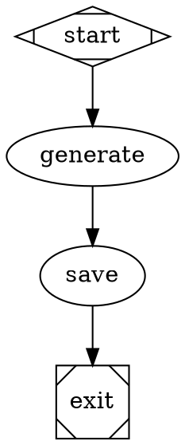

# Spec: Output Handler - Write Generated Code to Filesystem

## Problem

Workflows generate code/artifacts in logs but don't write them to the source tree.

## Solution: Output Handler

Add an `output` handler that writes content to files based on workflow results.

### How It Works

1. **Generate**: LLM generates code in response
2. **Format**: Output includes file path marker (e.g., `FILE: src/index.js`)
3. **Write**: Output handler writes content to specified path

### Node Attribute

```dot
write_code [
    handler="output",
    prompt="Create a simple hello world function",
    output_file="src/examples/hello.js"
]
```

### Or from previous node result

```dot
generate_code [
    handler="codegen",
    prompt="Write a fibonacci function"
]

save_code [
    handler="output",
    source="generate_code",
    output_file="src/lib/fibonacci.js"
]
```

### Response Format (Alternative)

The LLM can output in a special format:

```
FILE: src/index.js
---
export function hello() {
  console.log('Hello, World!');
}
---
```

The handler parses this format and writes to the file.

## Implementation

### Handler: `output`

```javascript
{
  handler: "output",
  output_file: "src/path/to/file.js",  // Where to write
  source: "node_id",                     // Optional: read from previous node's output
  content: "..."                          // Optional: explicit content
}
```

### Operations

| Attribute | Description |
|-----------|-------------|
| `output_file` | Target file path (required) |
| `source` | Read from previous node's response |
| `content` | Explicit content to write |
| `template` | Use template with placeholders |
| `mode` | `write` (default) or `append` |

## Example Workflow: Generate and Save



## Acceptance Criteria

- [ ] Output handler registered in registry
- [ ] Can write to files from explicit content
- [ ] Can read from previous node's response
- [ ] FILE: marker parsing works
- [ ] Path validation (sandboxed to project)
- [ ] Creates parent directories as needed

## Security

Same as FilesystemHandler:
- Path sandboxing
- File size limits
- Allowed file types (optional)
